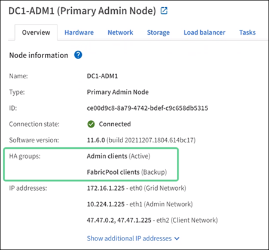

= 什麼是高可用性 (HA) 組？
:allow-uri-read: 
:icons: font
:imagesdir: ../media/

[role="lead"]
高可用性 (HA) 群組為 S3 用戶端提供高可用性資料連接，並為網格管理器和租用戶管理器提供高可用性連接。

您可以將多個管理和網關節點的網路介面分組為高可用性 (HA) 群組。如果 HA 群組中的活動介面發生故障，則備用介面可以管理工作負載。

每個 HA 群組提供對選定節點上的共用服務的存取。

* 包含網關節點、管理節點或兩者的 HA 群組為 S3 用戶端提供高可用性資料連線。
* 僅包含管理節點的 HA 群組為網格管理器和租戶管理器提供高可用性連線。
* 僅包含服務設備和基於 VMware 的軟體節點的 HA 群組可以為link:../admin/manage-s3-select-for-tenant-accounts.html["使用 S3 Select 的 S3 租用戶"]。使用 S3 Select 時建議使用 HA 組，但這不是必需的。

== 如何建立 HA 組？

. 您為一個或多個管理節點或網關節點選擇一個網路介面。您可以使用網格網路（eth0）介面、客戶端網路（eth2）介面、VLAN 介面或已新增至節點的存取介面。
+

NOTE: 如果介面具有 DHCP 指派的 IP 位址，則無法將其新增至 HA 群組。

. 您指定一個介面作為主介面。除非發生故障，否則主介面是活動介面。
. 您可以確定任何備份介面的優先順序。
. 您為該群組指派 1 到 10 個虛擬 IP (VIP) 位址。客戶端應用程式可以使用這些 VIP 位址中的任何一個連接到StorageGRID。

有關說明，請參閱link:configure-high-availability-group.html["配置高可用性組"]。

== 活動介面是什麼？

在正常運作期間，HA 組的所有 VIP 位址都會新增至主接口，即優先順序中的第一個介面。只要主介面保持可用，當客戶端連接到該群組的任何 VIP 位址時就會使用它。也就是說，在正常運作期間，主介面是該群組的「活動」介面。

同樣，在正常運作期間，HA 組的任何較低優先權介面都充當「備份」介面。除非主（目前活動）介面不可用，否則不會使用這些備份介面。

== 查看節點當前HA組狀態

若要查看某個節點是否已指派給 HA 群組並確定其目前狀態，請選擇 *NODES* > *_node_*。

如果「*概覽*」標籤包含「*HA 群組*」條目，則節點將指派給列出的 HA 群組。組名後面的值是該節點在HA組中的目前狀態：

* *活動*：HA 群組目前託管在此節點上。
* *備份*：HA 群組目前未使用此節點；這是一個備份介面。
* *已停止*：由於高可用性（keepalived）服務已被手動停止，因此 HA 群組無法託管在此節點上。
* *故障*：由於以下一個或多個原因，HA 群組無法託管在此節點上：
+
** 負載平衡器（nginx-gw）服務未在節點上執行。
** 節點的 eth0 或 VIP 介面已關閉。
** 節點已關閉。

在此範例中，主管理節點已新增至兩個 HA 群組。該節點目前是管理員客戶端群組的活動介面和FabricPool客戶端群組的備份介面。

== 當活動介面發生故障時會發生什麼？

目前託管 VIP 位址的介面是活動介面。如果 HA 群組包含多個介面且活動介面發生故障，則 VIP 位址將依優先順序移至第一個可用的備用介面。如果該接口發生故障，VIP 位址將移動到下一個可用的備份接口，依此類推。

下列任一原因都可能觸發故障轉移：

* 配置該介面的節點發生故障。
* 配置此介面的節點與所有其他節點失去連線至少 2 分鐘。
* 活動介面處於 Down 狀態。
* 負載平衡器服務停止。
* 高可用性服務停止。

NOTE: 託管活動介面的節點外部的網路故障可能不會觸發故障轉移。同樣，故障轉移不是由網格管理器或租戶管理器的服務觸發的。

故障轉移過程通常只需要幾秒鐘，而且速度足夠快，客戶端應用程式幾乎不會受到任何影響，並且可以依靠正常的重試行為繼續運行。

當故障解決並且更高優先權的介面再次可用時，VIP 位址將自動移至可用的最高優先權介面。
