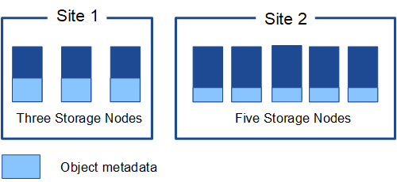

= 管理對像元資料存儲
:allow-uri-read: 
:icons: font
:imagesdir: ../media/

[role="lead"]
StorageGRID系統的物件元資料容量控制該系統上可儲存的最大物件數量。為了確保您的StorageGRID系統有足夠的空間來儲存新對象，您必須了解StorageGRID儲存對像元資料的位置和方式。

== 什麼是對像元資料？

對像元資料是描述對象的任何資訊。  StorageGRID使用物件元資料來追蹤網格中所有物件的位置並管理每個物件的生命週期。

對於StorageGRID中的對象，對像元資料包括以下類型的信息：

* 系統元數據，包括每個物件的唯一 ID（UUID）、物件名稱、S3 儲存桶的名稱、租用戶帳戶名稱或 ID、物件的邏輯大小、物件首次建立的日期和時間以及物件最後修改的日期和時間。
* 與物件關聯的任何自訂用戶元資料鍵值對。
* 對於 S3 對象，與該對象關聯的任何對象標籤鍵值對。
* 對於複製的物件副本，每個副本的目前儲存位置。
* 對於擦除編碼物件副本，每個片段的目前儲存位置。
* 對於雲端儲存池中的物件副本，物件的位置，包括外部儲存桶的名稱和物件的唯一識別碼。
* 對於分段對象和多部分對象，分段標識符和資料大小。

== 對像元資料如何儲存？

StorageGRID在 Cassandra 資料庫中維護物件元數據，該資料庫獨立於物件資料進行儲存。為了提供冗餘並保護物件元資料免於遺失， StorageGRID在每個站點儲存系統中所有物件的元資料的三個副本。

此圖代表兩個站點的儲存節點。每個站點都有相同數量的物件元數據，並且每個站點的元數據在該站點的所有儲存節點之間細分。

== 物件元資料儲存在哪裡？

此圖表示單一儲存節點的儲存量。

image::../media/metadata_space_storage_node.png[元資料空間儲存節點]

如圖所示， StorageGRID在每個儲存節點的儲存磁碟區 0 上為物件元資料保留空間。它使用保留空間來儲存物件元資料並執行必要的資料庫操作。儲存磁碟區 0 和儲存節點中所有其他儲存磁碟區上的任何剩餘空間專門用於物件資料（複製的副本和擦除編碼片段）。

特定儲存節點上為物件元資料保留的空間量取決於幾個因素，如下所述。

== 元資料保留空間設置

_元資料保留空間_是系統範圍的設置，表示每個儲存節點的磁碟區 0 上為元資料保留的空間量。如表所示，此設定的預設值是基於：

* 您最初安裝StorageGRID時所使用的軟體版本。
* 每個儲存節點上的 RAM 數量。

[cols="1a,1a,1a"]
|===
| 用於初始StorageGRID安裝的版本 | 儲存節點上的 RAM 數量 | 預設元資料保留空間設置 

 a| 
11.5 至 11.9
 a| 
網格中每個儲存節點上 128 GB 或更多
 a| 
8 TB（8,000 GB）

 a| 
 a| 
網格中任何儲存節點上的容量小於 128 GB
 a| 
3 TB（3,000 GB）

 a| 
11.1 至 11.4
 a| 
任何一個站點的每個儲存節點上都有 128 GB 或更多
 a| 
4 TB（4,000 GB）

 a| 
 a| 
每個站點的任何儲存節點上少於 128 GB
 a| 
3 TB（3,000 GB）

 a| 
11.0 或更早版本
 a| 
任何金額
 a| 
2 TB（2,000 GB）

|===

=== 查看元資料保留空間設置

請依照下列步驟查看StorageGRID系統的元資料保留空間設定。

.步驟
. 選擇*配置* > *系統* > *儲存設定*。
. 在儲存設定頁面上，展開「元資料保留空間」部分。

對於StorageGRID 11.8 或更高版本，元資料保留空間值必須至少為 100 GB 且不超過 1 PB。

對於新的StorageGRID 11.6 或更高版本安裝，其中每個儲存節點具有 128 GB 或更多 RAM，其預設為 8,000 GB（8 TB）。

== 元資料實際保留空間

與系統範圍的元資料保留空間設定相反，物件元資料的_實際保留空間_是針對每個儲存節點確定的。對於任何給定的儲存節點，元資料的實際保留空間取決於節點的磁碟區 0 的大小和系統範圍的元資料保留空間設定。

[cols="1a,1a"]
|===
| 節點的磁碟區 0 的大小 | 元資料實際保留空間 

 a| 
少於 500 GB（非生產用途）
 a| 
10% 音量 0

 a| 
500 GB 或更多 + 或 + 僅元資料儲存節點
 a| 
以下值中較小的一個：

* 第 0 卷
* 元資料保留空間設置

*注意*：僅元資料儲存節點只需要一個 rangedb。

|===

=== 查看元資料實際預留空間

請依照下列步驟查看特定儲存節點上元資料的實際保留空間。

.步驟
. 從網格管理器中，選擇 *NODES* > *_Storage Node_*。
. 選擇“*儲存*”標籤。
. 將遊標放在「已使用儲存 - 物件元資料」圖表上並找到「實際保留」值。
+
image::../media/storage_used_object_metadata_actual_reserved.png[已用儲存 - 物件元資料 - 實際預留]

在螢幕截圖中，「實際保留」值為 8 TB。此螢幕截圖適用於新StorageGRID 11.6 安裝中的大型儲存節點。由於系統範圍的元資料預留空間設定小於此儲存節點的磁碟區 0，因此此節點的實際預留空間等於元資料預留空間設定。

== 實際保留元資料空間的範例

假設您使用 11.7 或更高版本安裝新的StorageGRID系統。對於此範例，假設每個儲存節點都有超過 128 GB 的 RAM，且儲存節點 1 (SN1) 的磁碟區 0 為 6 TB。基於這些價值觀：

* 系統範圍的*元資料保留空間*設定為 8 TB。  （如果每個儲存節點都有超過 128 GB 的 RAM，則這是新StorageGRID 11.6 或更高版本安裝的預設值。）
* SN1 實際預留的元資料空間為 6 TB。  （由於磁碟區 0 小於 *元資料保留空間* 設置，因此整個磁碟區都被保留。）

== 允許的元資料空間

每個儲存節點為元資料實際保留的空間細分為可用於物件元資料的空間（_允許的元資料空間_）和基本資料庫操作（例如壓縮和修復）以及未來硬體和軟體升級所需的空間。允許的元資料空間決定了整體物件容量。

image::../media/metadata_allowed_space_volume_0.png[元資料允許空間卷 0]

下表顯示了StorageGRID如何根據節點的記憶體量和元資料的實際保留空間來計算不同儲存節點的*允許的元資料空間*。

[cols="1a,1a,2a,2a"]
|===

 a| 
 a| 
 a| 
*儲存節點上的記憶體量*

 a| 
 a| 
 a| 
小於 128 GB
 a| 
≥ 128 GB

 a| 
*實際為元資料保留的空間*
 a| 
≤ 4 TB
 a| 
元資料實際預留空間的 60%，最大可達 1.32 TB
 a| 
元資料實際預留空間的 60%，最大可達 1.98 TB

 a| 
大於 4 TB
 a| 
（實際預留元資料空間-1TB）×60%，最大可達1.32TB
 a| 
（實際預留元資料空間-1TB）×60%，最大3.96TB

|===

=== 查看允許的元資料空間

請依照下列步驟查看儲存節點允許的元資料空間。

.步驟
. 從網格管理器中選擇*NODES*。
. 選擇儲存節點。
. 選擇“*儲存*”標籤。
. 將遊標放在使用的儲存空間 - 物件元資料圖表上並找到*允許*值。
+
image::../media/storage_used_object_metadata_allowed.png[已用儲存 - 物件元資料 - 允許]

在螢幕截圖中，*允許*值為 3.96 TB，這是實際為元資料保留的空間超過 4 TB 的儲存節點的最大值。

*Allowed* 值對應於此 Prometheus 指標：

`storagegrid_storage_utilization_metadata_allowed_bytes`

== 允許的元資料空間範例

假設您使用版本 11.6 安裝StorageGRID系統。對於此範例，假設每個儲存節點都有超過 128 GB 的 RAM，且儲存節點 1 (SN1) 的磁碟區 0 為 6 TB。基於這些價值觀：

* 系統範圍的*元資料保留空間*設定為 8 TB。  （當每個儲存節點具有超過 128 GB 的 RAM 時，這是StorageGRID 11.6 或更高版本的預設值。）
* SN1 實際預留的元資料空間為 6 TB。  （由於磁碟區 0 小於 *元資料保留空間* 設置，因此整個磁碟區都被保留。）
* 根據<<table-allowed-space-for-metadata,允許元資料空間的表>>：（實際預留元資料空間-1TB）×60%，最大為3.96TB。

== 不同大小的儲存節點如何影響物件容量

如上所述， StorageGRID在每個站點的儲存節點上均勻分佈物件元資料。因此，如果網站包含不同大小的儲存節點，則站點上最小的節點決定了站點的元資料容量。

請考慮以下範例：

* 您有一個包含三個不同大小的儲存節點的單站點網格。
* *元資料保留空間*設定為 4 TB。
* 儲存節點實際保留的元資料空間和允許的元資料空間有以下值。
+
[cols="1a,1a,1a,1a"]
|===
| 儲存節點 | 卷 0 的大小 | 實際預留元資料空間 | 允許的元資料空間 

 a| 
SN1
 a| 
2.2TB
 a| 
2.2TB
 a| 
1.32TB

 a| 
SN2
 a| 
5TB
 a| 
4TB
 a| 
1.98TB

 a| 
SN3
 a| 
6TB
 a| 
4TB
 a| 
1.98TB

|===

由於物件元資料均勻分佈在站點的各個儲存節點上，因此本例中的每個節點只能容納 1.32 TB 的元資料。  SN2 和 SN3 允許的額外 0.66 TB 元資料空間無法使用。

image::../media/metadata_space_three_storage_nodes.png[元資料空間 三個儲存節點]

同樣，由於StorageGRID在每個站點維護StorageGRID系統的所有物件元數據，因此StorageGRID系統的整體元資料容量由最小站點的物件元資料容量決定。

由於物件元資料容量控制最大物件數，因此當一個節點的元資料容量耗盡時，網格實際上已滿。

.相關資訊
* 若要了解如何監控每個儲存節點的物件元資料容量，請參閱link:../monitor/index.html["監控StorageGRID"]。
* 為了增加系統的物件元資料容量，link:../expand/index.html["展開網格"]透過新增新的儲存節點。

