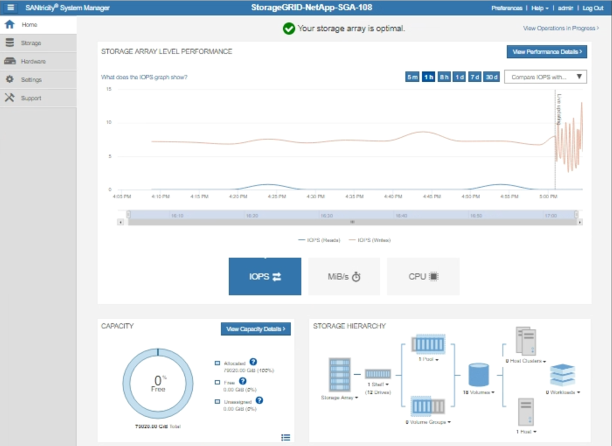

= 透過StorageGRID發送 E 系列AutoSupport包
:allow-uri-read: 
:icons: font
:imagesdir: ../media/

[role="lead"]
您可以透過StorageGRID管理節點（而非儲存設備管理連接埠）將 E 系列SANtricity System Manager AutoSupport套件傳送給技術支援。

看 https://docs.netapp.com/us-en/e-series-santricity/sm-support/autosupport-feature-overview.html["E系列硬體AutoSupport"^]有關將AutoSupport與 E 系列設備結合使用的詳細資訊。

.開始之前
* 您已使用link:../admin/web-browser-requirements.html["支援的網頁瀏覽器"]。
* 你有link:admin-group-permissions.html["儲存設備管理員或 Root 存取權限"]。
* 您已設定SANtricity AutoSupport：
+
** 對於 SG6000 和 SG5700 設備， https://docs.netapp.com/us-en/storagegrid-appliances/installconfig/accessing-and-configuring-santricity-system-manager.html["在SANtricity System Manager 中配置AutoSupport"^]

NOTE: 您必須擁有SANtricity韌體 8.70 或更高版本才能使用網格管理器存取SANtricity System Manager。

.關於此任務
E 系列AutoSupport套件包含儲存硬體的詳細信息，並且比StorageGRID系統發送的其他AutoSupport套件更具體。

您可以在SANtricity System Manager 中設定一個特殊的代理伺服器位址，以便透過StorageGRID管理節點傳輸AutoSupport包，而無需使用設備的管理連接埠。以這種方式傳輸的AutoSupport包由link:../primer/what-admin-node-is.html["首選發送者管理節點"]，他們使用任何link:../admin/configuring-admin-proxy-settings.html["管理員代理設定"]已在網格管理器中配置。

NOTE: 此程序僅適用於為 E 系列AutoSupport套件配置StorageGRID代理伺服器。有關 E 系列AutoSupport配置的更多詳細信息，請參閱 https://docs.netapp.com/us-en/e-series-family/index.html["NetApp E 系列和SANtricity文檔"^]。

.步驟
. 在網格管理器中，選擇*NODES*。
. 從左側的節點清單中，選擇要設定的儲存設備節點。
. 選擇* SANtricity System Manager*。
+
出現SANtricity System Manager 主頁。

+

. 選擇 *支援* > *支援中心* > *AutoSupport*。
+
出現AutoSupport操作頁面。

+
image::../media/autosupport_santricity_operations.png[AutoSupport SANtricity AutoSupport操作]

. 選擇*配置AutoSupport交付方法*。
+
出現「設定AutoSupport交付方法」頁面。

+
image::../media/autosupport_configure_delivery_santricity.png[AutoSupport配置AutoSupport交付方法SANtricity]

. 選擇 *HTTPS* 作為傳送方式。
+

NOTE: 已預先安裝啟用 HTTPS 的憑證。

. 選擇*透過代理伺服器*。
. 進入 `tunnel-host`用於*主機位址*。
+
`tunnel-host`是使用管理節點發送 E 系列AutoSupport套件的特殊位址。

. 進入 `10225`用於*連接埠號碼*。
+
`10225`是從裝置中的 E 系列控制器接收AutoSupport套件的StorageGRID代理伺服器上的連接埠號碼。

. 選擇「*測試配置*」來測試AutoSupport代理伺服器的路由和配置。
+
如果正確，則會出現一條綠色橫幅訊息：“您的AutoSupport配置已經驗證。”

+
如果測試失敗，則會在紅色橫幅中顯示錯誤訊息。檢查您的StorageGRID DNS 設定和網絡，確保link:../primer/what-admin-node-is.html["首選發送者管理節點"]可以連接到NetApp支援站點，然後再次嘗試測試。

. 選擇*儲存*。
+
配置已儲存，並出現確認訊息：“AutoSupport交付方法已配置。”

