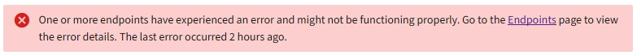

= 平台服務故障排除
:allow-uri-read: 
:icons: font
:imagesdir: ../media/

[role="lead"]
平台服務中使用的端點由租用戶用戶在租用戶管理器中建立和維護；但是，如果租用戶在配置或使用平台服務時遇到問題，您可能能夠使用網格管理器來協助解決問題。

== 新端點的問題

在租用戶可以使用平台服務之前，他們必須使用租用戶管理器建立一個或多個端點。每個端點代表一個平台服務的外部目標，例如StorageGRID S3 儲存桶、Amazon Web Services 儲存桶、Amazon Simple Notification Service 主題、Kafka 主題或在本機或 AWS 上託管的 Elasticsearch 叢集。每個端點都包含外部資源的位置和存取該資源所需的憑證。

當租用戶建立端點時， StorageGRID系統會驗證該端點是否存在以及是否可以使用指定的憑證存取該端點。每個站點的一個節點都會驗證與端點的連線。

如果端點驗證失敗，錯誤訊息會解釋端點驗證失敗的原因。租用戶用戶應解決該問題，然後嘗試再次建立端點。

NOTE: 如果未為租用戶帳戶啟用平台服務，則端點建立將會失敗。

== 現有端點的問題

如果StorageGRID嘗試存取現有端點時發生錯誤，則會在租用戶管理員的儀表板上顯示一則訊息。

租用戶用戶可以前往「端點」頁面查看每個端點的最新錯誤訊息，並確定錯誤發生的時間。 *上次錯誤*列顯示每個端點的最新錯誤訊息，並指示錯誤發生的時間。錯誤包括image:../media/icon_alert_red_critical.png["紅色X圖標"]圖示出現在過去 7 天內。

image::../media/endpoints_last_error.png[端點頁面的螢幕截圖，顯示「最後一個錯誤」列]

NOTE: *Last error* 欄位中的某些錯誤訊息可能包含括號中的 logID。網格管理員或技術支援可以使用此 ID 在 bycast.log 中查找有關錯誤的更多詳細資訊。

== 與代理伺服器相關的問題

如果您已配置link:configuring-storage-proxy-settings.html["儲存代理"]在儲存節點和平台服務端點之間，如果您的代理服務不允許來自StorageGRID的訊息，則可能會發生錯誤。若要解決這些問題，請檢查代理伺服器的設置，以確保與平台服務相關的訊息不會被封鎖。

== 確定是否發生錯誤

如果過去 7 天內發生任何端點錯誤，租用戶管理員中的儀表板將顯示一則警報訊息。您可以前往「端點」頁面查看有關該錯誤的更多詳細資訊。

== 客戶端操作失敗

某些平台服務問題可能會導致 S3 儲存桶上的用戶端操作失敗。例如，如果內部複製狀態機 (RSM) 服務停止，或排隊等待傳送的平台服務訊息太多，S3 用戶端操作將會失敗。

檢查服務狀態：

. 選擇*支援* > *工具* > *網格拓撲*。
. 選擇 *_site_* > *_Storage Node_* > *SSM* > *Services*。

== 可恢復和不可恢復的端點錯誤

端點建立後，平台服務請求可能會因各種原因而發生錯誤。某些錯誤可以透過使用者介入來恢復。例如，可恢復的錯誤可能由於以下原因而發生：

* 用戶的憑證已被刪除或已過期。
* 目標儲存桶不存在。
* 通知無法送達。

如果StorageGRID遇到可恢復的錯誤，則會重試平台服務請求，直到成功為止。

其他錯誤是無法恢復的。例如，如果刪除端點，則會發生不可恢復的錯誤。

如果StorageGRID遇到無法復原的端點錯誤：

* 在網格管理員中，前往 *支援* > *工具* > *指標* > *Grafana* > *平台服務概述* 查看錯誤詳情。
* 在租用戶管理員中，前往 *儲存 (S3)* > *平台服務端點* 查看錯誤詳情。
* 檢查 `/var/local/log/bycast-err.log`相關錯誤。具有 ADC 服務的儲存節點包含此日誌檔案。

== 平台服務訊息無法傳遞

如果目標遇到無法接受平台服務訊息的問題，則儲存桶上的用戶端操作會成功，但平台服務訊息不會被傳遞。例如，如果在目標上更新憑證，使得StorageGRID無法再對目標服務進行身份驗證，則可能會發生此錯誤。

檢查相關警報。

== 平台服務請求效能較慢

如果傳送請求的速率超過目標端點接收請求的速率， StorageGRID軟體可能會限制儲存桶的傳入 S3 請求。只有當有大量請求等待傳送到目標端點時才會發生限制。

唯一可見的效果是傳入的 S3 請求將需要更長時間才能執行。如果您開始偵測到效能明顯下降，則應降低攝取率或使用容量更高的端點。如果積壓的請求持續增加，客戶端 S3 操作（例如 PUT 請求）最終將會失敗。

CloudMirror 請求更有可能受到目標端點效能的影響，因為這些請求通常涉及比搜尋整合或事件通知請求更多的資料傳輸。

== 平台服務請求失敗

查看平台服務的請求失敗率：

. 選擇*NODES*。
. 選擇 *_site_* > *平台服務*。
. 查看請求錯誤率圖表。
+
image::../media/nodes_page_site_level_platform_services.gif[節點頁面網站層級平台服務]

== 平台服務不可用警報

*平台服務不可用*警報表示站點上無法執行任何平台服務操作，因為正在運行或可用的具有 RSM 服務的儲存節點太少。

RSM 服務確保平台服務請求傳送到各自的端​​點。

若要解決此警報，請確定網站中的哪些儲存節點包含 RSM 服務。 （RSM 服務存在於也包含 ADC 服務的儲存節點上。）然後，確保這些儲存節點中的大多數都在運行並且可用。

NOTE: 如果某個站點上包含 RSM 服務的多個儲存節點發生故障，您將遺失該站點的所有待處理的平台服務請求。

== 平台服務端點的其他故障排除指南

有關更多信息，請參閱link:../tenant/troubleshooting-platform-services-endpoint-errors.html["使用租用戶帳戶 > 平台服務端點故障排除"]。

.相關資訊
link:../troubleshoot/index.html["排除StorageGRID系統故障"]
