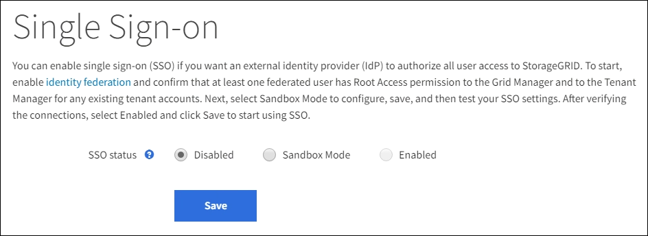
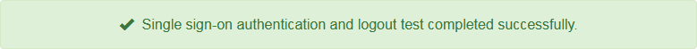

= 使用沙盒模式
:allow-uri-read: 
:icons: font
:imagesdir: ../media/

[role="lead"]
您可以使用沙盒模式來設定和測試單一登入 (SSO)，然後為所有StorageGRID使用者啟用它。啟用 SSO 後，您可以在需要變更或重新測試設定時返回沙盒模式。

.開始之前
* 您已使用link:../admin/web-browser-requirements.html["支援的網頁瀏覽器"]。
* 你有link:admin-group-permissions.html["Root存取權限"]。
* 您已為StorageGRID系統配置身份聯合。
* 對於身分識別聯合 *LDAP 服務類型*，您可以根據計畫使用的 SSO 身分提供者選擇 Active Directory 或 Azure。
+
[cols="1a,1a"]
|===
| 配置的 LDAP 服務類型 | SSO 身分提供者的選項 

 a| 
活動目錄
 a| 
** 活動目錄
** Azure
** Ping聯邦

 a| 
Azure
 a| 
Azure

|===

.關於此任務
當啟用 SSO 且使用者嘗試登入管理節點時， StorageGRID會向 SSO 身分提供者傳送驗證請求。反過來，SSO 身份提供者將身份驗證回應傳送回StorageGRID，指示身份驗證請求是否成功。對於成功的請求：

* Active Directory 或 PingFederate 的回應包括使用者的通用唯一識別碼 (UUID)。
* Azure 的回應包括使用者主體名稱 (UPN)。

為了允許StorageGRID （服務提供者）和 SSO 身分提供者就使用者驗證請求進行安全通信，您必須在StorageGRID中設定某些設定。接下來，您必須使用 SSO 身分提供者的軟體為每個管理節點建立信賴方信任 (AD FS)、企業應用程式 (Azure) 或服務提供者 (PingFederate)。最後，您必須返回StorageGRID以啟用 SSO。

沙盒模式可以輕鬆執行此來回配置，並在啟用 SSO 之前測試所有設定。當您使用沙盒模式時，使用者無法使用 SSO 登入。

== 訪問沙盒模式

.步驟
. 選擇*設定* > *存取控制* > *單一登入*。
+
出現「單一登入」頁面，其中選擇了「*已停用*」選項。

+

+

NOTE: 如果未出現 SSO 狀態選項，請確認您已將身分提供者設定為聯合身分識別來源。看link:requirements-for-sso.html["單一登入的要求和注意事項"] 。

. 選擇*沙盒模式*。
+
出現身分提供者部分。

== 輸入身份提供者詳細信息

.步驟
. 從下拉清單中選擇 *SSO 類型*。
. 根據您選擇的 SSO 類型填入身分提供者部分中的欄位。
+
[role="tabbed-block"]
====
.活動目錄
--
.. 輸入身分識別提供者的*聯合身分驗證服務名稱*，與其在 Active Directory 聯合驗證服務 (AD FS) 中顯示的名稱完全一致。
+

NOTE: 若要找到聯合服務名稱，請前往 Windows 伺服器管理員。選擇“工具”>“AD FS 管理”。從操作選單中，選擇*編輯聯合服務屬性*。聯合服務名稱顯示在第二個欄位中。

.. 指定當身分識別提供者回應StorageGRID請求傳送 SSO 設定資訊時將使用哪個 TLS 憑證來保護連線。
+
*** *使用作業系統 CA 憑證*：使用作業系統上安裝的預設 CA 憑證來保護連線。
*** *使用自訂 CA 憑證*：使用自訂 CA 憑證來保護連線。
+
如果選擇此設置，請複製自訂憑證的文字並將其貼上到 *CA 憑證* 文字方塊中。

*** *不要使用 TLS*：不要使用 TLS 憑證來保護連線。
+

CAUTION: 如果您更改了 CA 證書，請立即link:../maintain/starting-or-restarting-service.html["在管理節點上重新啟動 mgmt-api 服務"]並測試是否成功 SSO 進入網格管理器。

.. 在「依賴方」部分中，指定StorageGRID的「依賴方識別碼」。此值控制您在 AD FS 中為每個信賴方信任所使用的名稱。
+
*** 例如，如果您的網格只有一個管理節點，且您不打算在將來新增更多管理節點，請輸入 `SG`或者 `StorageGRID`。
*** 如果您的網格包含多個管理節點，請包含字串 `[HOSTNAME]`在標識符中。例如，  `SG-[HOSTNAME]` 。這將產生一個表，根據節點的主機名稱顯示系統中每個管理節點的依賴方識別碼。
+
image::../media/sso_status_sandbox_mode_active_directory.png[單一登入,Sandbox mode enabled,Relying party identifiers shown for several Admin Nodes]

+

NOTE: 您必須為StorageGRID系統中的每個管理節點建立一個依賴方信任。每個管理節點都擁有依賴方信任，確保使用者可以安全地登入和登出任何管理節點。

.. 選擇*儲存*。
+
*儲存*按鈕上會出現綠色複選標記，持續幾秒鐘。

+
image::../media/save_button_green_checkmark.gif[帶有綠色複選標記的“儲存”按鈕]

--
.Azure
--
.. 指定當身分識別提供者回應StorageGRID請求傳送 SSO 設定資訊時將使用哪個 TLS 憑證來保護連線。
+
*** *使用作業系統 CA 憑證*：使用作業系統上安裝的預設 CA 憑證來保護連線。
*** *使用自訂 CA 憑證*：使用自訂 CA 憑證來保護連線。
+
如果選擇此設置，請複製自訂憑證的文字並將其貼上到 *CA 憑證* 文字方塊中。

*** *不要使用 TLS*：不要使用 TLS 憑證來保護連線。
+

CAUTION: 如果您更改了 CA 證書，請立即link:../maintain/starting-or-restarting-service.html["在管理節點上重新啟動 mgmt-api 服務"]並測試是否成功 SSO 進入網格管理器。

.. 在企業應用程式部分，指定StorageGRID的 *企業應用程式名稱*。此值控制您在 Azure AD 中為每個企業應用程式使用的名稱。
+
*** 例如，如果您的網格只有一個管理節點，且您不打算在將來新增更多管理節點，請輸入 `SG`或者 `StorageGRID`。
*** 如果您的網格包含多個管理節點，請包含字串 `[HOSTNAME]`在標識符中。例如，  `SG-[HOSTNAME]` 。這將產生一個表，根據節點的主機名稱顯示系統中每個管理節點的企業應用程式名稱。
+
image::../media/sso_status_sandbox_mode_azure.png[單一登入,Sandbox mode enabled,Relying party identifiers shown for several Admin Nodes]

+

NOTE: 您必須為StorageGRID系統中的每個管理節點建立一個企業應用程式。每個管理節點都有一個企業應用程序，可確保使用者可以安全地登入和登出任何管理節點。

.. 請依照以下步驟操作link:../admin/creating-enterprise-application-azure.html["在 Azure AD 中建立企業應用程式"]為表中列出的每個管理節點建立一個企業應用程式。
.. 從 Azure AD 複製每個企業應用程式的聯合元資料 URL。然後，將此 URL 貼到StorageGRID中對應的 *Federation metadata URL* 欄位中。
.. 複製並貼上所有管理節點的聯合元資料 URL 後，選擇 *儲存*。
+
*儲存*按鈕上會出現綠色複選標記，持續幾秒鐘。

+
image::../media/save_button_green_checkmark.gif[帶有綠色複選標記的“儲存”按鈕]

--
.Ping聯邦
--
.. 指定當身分識別提供者回應StorageGRID請求傳送 SSO 設定資訊時將使用哪個 TLS 憑證來保護連線。
+
*** *使用作業系統 CA 憑證*：使用作業系統上安裝的預設 CA 憑證來保護連線。
*** *使用自訂 CA 憑證*：使用自訂 CA 憑證來保護連線。
+
如果選擇此設置，請複製自訂憑證的文字並將其貼上到 *CA 憑證* 文字方塊中。

*** *不要使用 TLS*：不要使用 TLS 憑證來保護連線。
+

CAUTION: 如果您更改了 CA 證書，請立即link:../maintain/starting-or-restarting-service.html["在管理節點上重新啟動 mgmt-api 服務"]並測試是否成功 SSO 進入網格管理器。

.. 在服務提供者 (SP ) 部分中，指定StorageGRID的 * SP連線 ID *。此值控制您在 PingFederate 中為每個SP連線使用的名稱。
+
*** 例如，如果您的網格只有一個管理節點，且您不打算在將來新增更多管理節點，請輸入 `SG`或者 `StorageGRID`。
*** 如果您的網格包含多個管理節點，請包含字串 `[HOSTNAME]`在標識符中。例如，  `SG-[HOSTNAME]` 。這將產生一個表，根據節點的主機名稱顯示系統中每個管理節點的SP連線 ID。
+
image::../media/sso_status_sandbox_mode_ping_federated.png[單一登入,Sandbox mode enabled,Relying party identifiers shown for several Admin Nodes]

+

NOTE: 您必須為StorageGRID系統中的每個管理節點建立一個SP連線。每個管理節點都有一個SP連接，可確保使用者可以安全地登入和登出任何管理節點。

.. 在 *Federation metadata URL* 欄位中指定每個管理節點的聯合元資料 URL。
+
使用以下格式：

+
[listing]
----
https://<Federation Service Name>:<port>/pf/federation_metadata.ping?PartnerSpId=<SP Connection ID>
----
.. 選擇*儲存*。
+
*儲存*按鈕上會出現綠色複選標記，持續幾秒鐘。

+
image::../media/save_button_green_checkmark.gif[帶有綠色複選標記的“儲存”按鈕]

--
====

== 配置信賴方信任、企業應用程式或SP連接

儲存配置後，會出現沙盒模式確認通知。此通知確認沙盒模式現已啟用並提供概述說明。

StorageGRID可依需求維持沙盒模式。但是，當在單一登入頁面上選擇「沙盒模式」時，所有StorageGRID使用者的 SSO 都會被停用。只有本地用戶可以登入。

請依照下列步驟設定信賴方信任（Active Directory）、完成企業應用程式（Azure）或設定SP連線（PingFederate）。

[role="tabbed-block"]
====
.活動目錄
--
.步驟
. 前往 Active Directory 聯合驗證服務 (AD FS)。
. 使用StorageGRID單一登入頁面上的表格中顯示的每個依賴方標識符，為StorageGRID建立一個或多個依賴方信任。
+
您必須為表中顯示的每個管理節點建立一個信任。

+
有關說明，請訪問link:../admin/creating-relying-party-trusts-in-ad-fs.html["在 AD FS 中創造信賴方信任"]。

--
.Azure
--
.步驟
. 從您目前登入的管理節點的單一登入頁面，選擇按鈕下載並儲存 SAML 元資料。
. 然後，對於網格中的任何其他管理節點，重複以下步驟：
+
.. Sign in節點。
.. 選擇*設定* > *存取控制* > *單一登入*。
.. 下載並儲存該節點的 SAML 元資料。

. 前往 Azure 入口網站。
. 請依照以下步驟操作link:../admin/creating-enterprise-application-azure.html["在 Azure AD 中建立企業應用程式"]將每個管理節點的 SAML 元資料檔案上傳到其對應的 Azure 企業應用程式中。

--
.Ping聯邦
--
.步驟
. 從您目前登入的管理節點的單一登入頁面，選擇按鈕下載並儲存 SAML 元資料。
. 然後，對於網格中的任何其他管理節點，重複以下步驟：
+
.. Sign in節點。
.. 選擇*設定* > *存取控制* > *單一登入*。
.. 下載並儲存該節點的 SAML 元資料。

. 前往 PingFederate。
. link:../admin/creating-sp-connection-ping.html["為StorageGRID建立一個或多個服務提供者 ( SP ) 連接"] 。使用每個管理節點的SP連線 ID（顯示在StorageGRID單一登入頁面上的表格中）以及為該管理節點下載的 SAML 元資料。
+
您必須為表格中顯示的每個管理節點建立一個SP連線。

--
====

== 測試 SSO 連接

在強制整個StorageGRID系統使用單一登入之前，您應該確認每個管理節點的單一登入和單一登出都已正確配置。

[role="tabbed-block"]
====
.活動目錄
--
.步驟
. 在StorageGRID單一登入頁面中，找到沙盒模式訊息中的連結。
+
該 URL 源自於您在 *聯合服務名稱* 欄位中輸入的值。

+
image::../media/sso_sandbox_mode_url.gif[身分提供者登入頁面的 URL]

. 選擇連結或將 URL 複製並貼上到瀏覽器中，以存取您的身分提供者的登入頁面。
. 若要確認您可以使用 SSO 登入StorageGRID，請選擇 *Sign in下列網站之一*，選擇主管理節點的信賴方標識符，然後選擇 *Sign in*。
+
image::../media/sso_sandbox_mode_testing.gif[在 SSO 沙盒模式下測試依賴方信任]

. 輸入您的聯合用戶名和密碼。
+
** 如果 SSO 登入和登出操作成功，則會顯示成功訊息。
+

** 如果 SSO 操作不成功，則會顯示錯誤訊息。解決問題，清除瀏覽器的 cookie，然後重試。

. 重複這些步驟來驗證網格中每個管理節點的 SSO 連線。

--
.Azure
--
.步驟
. 前往 Azure 入口網站中的單一登入頁面。
. 選擇*測試此應用程式*。
. 輸入聯合用戶的憑證。
+
** 如果 SSO 登入和登出操作成功，則會顯示成功訊息。
+

** 如果 SSO 操作不成功，則會顯示錯誤訊息。解決問題，清除瀏覽器的 cookie，然後重試。

. 重複這些步驟來驗證網格中每個管理節點的 SSO 連線。

--
.Ping聯邦
--
.步驟
. 從StorageGRID單一登入頁面，選擇沙盒模式訊息中的第一個連結。
+
一次選擇並測試一個連結。

+
image::../media/sso_sandbox_mode_enabled_ping.png[單一登入]

. 輸入聯合用戶的憑證。
+
** 如果 SSO 登入和登出操作成功，則會顯示成功訊息。
+

** 如果 SSO 操作不成功，則會顯示錯誤訊息。解決問題，清除瀏覽器的 cookie，然後重試。

. 選擇下一個連結來驗證網格中每個管理節點的 SSO 連線。
+
如果您看到「頁面已過期」訊息，請選擇瀏覽器中的「*返回*」按鈕並重新提交您的憑證。

--
====

== 啟用單一登入

當您確認可以使用 SSO 登入每個管理節點後，您可以為整個StorageGRID系統啟用 SSO。

TIP: 啟用 SSO 後，所有使用者都必須使用 SSO 來存取網格管理器、租用戶管理器、網格管理 API 和租用戶管理 API。本機用戶無法再存取StorageGRID。

.步驟
. 選擇*設定* > *存取控制* > *單一登入*。
. 將 SSO 狀態變更為 *已啟用*。
. 選擇*儲存*。
. 查看警告訊息，然後選擇“*確定*”。
+
單一登入現已啟用。

TIP: 如果您使用 Azure 入口網站並從用於存取 Azure 的相同電腦存取StorageGRID ，請確保 Azure 入口網站使用者也是授權的StorageGRID使用者（已匯入StorageGRID 的聯合群組中的使用者）或在嘗試登入StorageGRID之前登出 Azure 入口網站。
