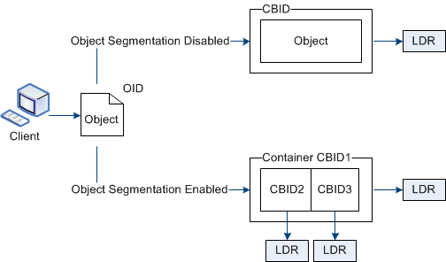

= 什麼是對象分割？
:allow-uri-read: 
:icons: font
:imagesdir: ../media/

[role="lead"]
物件分割是將一個物件分割成一組較小的固定大小物件的過程，以最佳化大物件的儲存和資源使用。  S3 多部分上傳也會建立分段對象，每個部分都有一個對象代表。

當物件被攝取到StorageGRID系統時，LDR 服務會將物件拆分為多個段，並建立一個段容器，將所有段的標頭資訊列為內容。

在檢索到段容器時，LDR 服務會從其段組裝原始物件並將該物件傳回給客戶端。

容器和段不一定儲存在同一個儲存節點上。容器和段可以儲存在 ILM 規則中指定的儲存池內的任何儲存節點上。

每個段都由StorageGRID系統獨立處理，並有助於統計管理物件和儲存物件等屬性的數量。例如，如果儲存到StorageGRID系統的物件被分成兩個區段，則在攝取完成後，「託管物件」的值將增加 3，如下所示：

`segment container + segment 1 + segment 2 = three stored objects`
