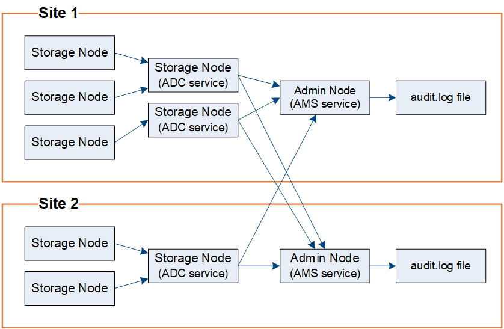

= 審計訊息流和保留
:allow-uri-read: 
:icons: font
:imagesdir: ../media/

[role="lead"]
所有StorageGRID服務在正常系統運作期間都會產生稽核訊息。您應該了解這些審計訊息如何透過StorageGRID系統傳輸到 `audit.log`文件。

== 審計訊息流

審計訊息由管理節點和具有管理網域控制器 (ADC) 服務的儲存節點處理。

如審計訊息流程圖所示，每個StorageGRID節點將其稽核訊息傳送到資料中心站點的其中一個 ADC 服務。每個網站安裝的前三個儲存節點都會自動啟用 ADC 服務。

反過來，每個 ADC 服務充當中繼，並將其審計訊息集合傳送到StorageGRID系統中的每個管理節點，這為每個管理節點提供了系統活動的完整記錄。

每個管理節點都將稽核訊息儲存在文字日誌檔案中；活動日誌檔案名為 `audit.log`。

=== 審計訊息保留

StorageGRID使用複製和刪除程序來確保在將稽核訊息寫入稽核日誌之前不會遺失任何稽核訊息。

當節點產生或中繼稽核訊息時，該訊息將儲存在網格節點系統磁碟上的稽核訊息佇列中。訊息的副本始終保存在審計訊息佇列中，直到該訊息寫入管理節點的稽核日誌檔案為止 `/var/local/log`目錄。這有助於防止審計訊息在傳輸過程中遺失。

image::../media/audit_message_retention.gif[總結 AMS 審計訊息接收情況的圖表]

由於網路連線問題或審計容量不足，審計訊息佇列可能會暫時增加。隨著佇列的增加，它們會消耗每個節點的更多可用空間 `/var/local/`目錄。如果問題仍然存在，並且節點的審計訊息目錄變得太滿，則各個節點將優先處理其積壓訊息，並暫時無法接收新訊息。

具體來說，您可能會看到以下行為：

* 如果 `/var/local/log`管理節點使用的目錄已滿，則管理節點將被標記為無法接收新的稽核訊息，直到目錄不再滿為止。S3 客戶端請求不受影響。當審計儲存庫無法存取時，會觸發 XAMS（無法存取的審計儲存庫）警報。
* 如果 `/var/local/`如果具有 ADC 服務的儲存節點所使用的目錄已滿 92%，則該節點將被標記為不可用於審核訊息，直到目錄僅滿 87% 為止。S3 客戶端對其他節點的請求不受影響。當審計中繼無法存取時，會觸發 NRLY（可用審計中繼）警報。
+

NOTE: 如果沒有可用的儲存節點提供 ADC 服務，儲存節點會將稽核訊息儲存在 `/var/local/log/localaudit.log`文件。

* 如果 `/var/local/`當儲存節點使用的目錄已滿 85% 時，該節點將開始拒絕 S3 用戶端請求 `503 Service Unavailable`。

以下類型的問題可能會導致審核訊息佇列變得非常大：

* 具有 ADC 服務的管理節點或儲存節點中斷。如果系統的一個節點發生故障，其餘節點可能會積壓。
* 持續的活動率超出了系統的審計能力。
* 這 `/var/local/`由於與稽核訊息無關的原因，ADC 儲存節點上的空間已滿。發生這種情況時，節點將停止接受新的審計訊息並優先處理其當前積壓，這可能會導致其他節點積壓。

=== 大型審計佇列警報和審計訊息佇列 (AMQS) 警報

為了協助您監控稽核訊息佇列隨時間的大小，當儲存節點佇列或管理節點佇列中的訊息數量達到特定閾值時，將觸發*大型稽核佇列*警報和舊式 AMQS 警報。

如果觸發了「大型審計佇列」警報或舊式 AMQS 警報，請先檢查系統負載——如果最近有大量交易，則警報和警報應該會隨著時間的推移而解決，並且可以忽略。

如果警報或警告持續且嚴重程度增加，請查看佇列大小圖表。如果該數字在數小時或數天內穩定增加，則審計負載可能已經超出了系統的審計容量。透過將客戶端寫入和客戶端讀取的稽核等級變更為錯誤或關閉，降低客戶端操作率或減少記錄的稽核訊息數量。看link:../monitor/configure-audit-messages.html["配置審計訊息和日誌目標"] 。

=== 重複訊息

如果發生網路或節點故障， StorageGRID系統會採取保守的方法。因此，審計日誌中可能存在重複的訊息。
