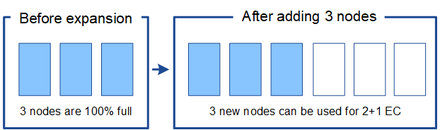

= 重新平衡糾刪碼資料的注意事項
:allow-uri-read: 
:icons: font
:imagesdir: ../media/

[role="lead"]
如果您正在執行擴充功能以新增儲存節點，並且使用 ILM 規則來擦除程式碼數據，則如果您無法為所使用的擦除編碼方案添加足夠的儲存節點，則可能需要執行擦除編碼 (EC) 重新平衡程序。

審查完這些考慮因素後，進行擴展，然後轉到link:rebalancing-erasure-coded-data-after-adding-storage-nodes.html["新增儲存節點後重新平衡擦除編碼數據"]運行該過程。

== 什麼是 EC 再平衡？

EC 重新平衡是儲存節點擴充後可能需要的StorageGRID程式。該過程作為主管理節點的命令列腳本運行。當您執行 EC 重新平衡程式時， StorageGRID會在網站的現有儲存節點和新新增的儲存節點之間重新指派擦除編碼片段。

EC 重新平衡程序：

* 僅移動擦除編碼的物件資料。它不會移動複製的物件資料。
* 在站點內重新分配資料。它不會在站點之間移動資料。
* 在站點的所有儲存節點之間重新分配資料。它不會在儲存卷內重新分配資料。
* 在確定將擦除編碼資料移動到何處時，不考慮每個儲存節點上的複製資料使用情況。
* 在儲存節點之間均勻地重新分配擦除編碼數據，而不考慮每個節點的相對容量。
* 不會將擦除編碼資料分發到已滿 80% 以上的儲存節點。
* 運行時可能會降低 ILM 操作和 S3 用戶端操作的效能—需要額外的資源來重新分配擦除編碼片段。

當 EC 重新平衡過程完成時：

* 擦除編碼資料將從可用空間較少的儲存節點移動到可用空間較多的儲存節點。
* 擦除編碼物件的資料保護將保持不變。
* 由於兩個原因，儲存節點之間的已使用 (%) 值可能不同：
+
** 複製的物件副本將繼續消耗現有節點上的空間—EC 重新平衡過程不會移動複製的資料。
** 儘管所有節點最終都會擁有大致相同數量的擦除編碼數據，但容量較大的節點相對容量較小的節點來說不太滿。
+
例如，假設三個 200 TB 節點各自填入 80%（每個節點 200 ÷ 0.8 = 160 TB，或站點 480 TB）。如果您新增 400 TB 的節點並執行重新平衡程序，則所有節點現在將具有大約相同數量的擦除碼資料（480/4 = 120 TB）。但是，較大節點的使用率 (%) 將小於較小節點的使用率 (%)。

+
image::../media/used_space_with_larger_node.png[擴充前已用空間]

== 何時重新平衡糾刪碼數據

請考慮以下情況：

* StorageGRID在單一站點上運行，該站點包含三個儲存節點。
* ILM 策略對所有大於 1.0 MB 的物件使用 2+1 擦除編碼規則，對較小的物件使用 2 副本複製規則。
* 所有儲存節點都已完全填滿。  「*低物件儲存*」警報已觸發，嚴重程度達到「嚴重」等級。
+
image::../media/used_space_before_expansion.png[擴充前已用空間]

=== 如果新增足夠的節點，則不需要重新平衡

為了了解何時不需要 EC 重新平衡，假設您新增了三個（或更多）新的儲存節點。在這種情況下，您不需要執行 EC 重新平衡。原始儲存節點將保持滿載狀態，但新物件現在將使用三個新節點進行 2+1 擦除編碼——兩個資料片段和一個奇偶校驗片段可以分別儲存在不同的節點上。

CAUTION: 雖然在這種情況下您可以執行 EC 重新平衡程序，但移動現有的擦除編碼資料將暫時降低網格的效能，這可能會影響客戶端操作。

=== 如果無法新增足夠的節點，則需要重新平衡

為了了解何時需要 EC 重新平衡，假設您只能新增兩個儲存節點，而不是三個。由於 2+1 方案需要至少三個儲存節點才有可用空間，因此空節點不能用於新的擦除編碼資料。

image::../media/used_space_after_2_node_expansion.png[雙節點擴展後已用空間]

要使用新的儲存節點，您應該執行 EC 重新平衡程式。當此程序執行時， StorageGRID會在網站的所有儲存節點之間重新指派現有的擦除編碼資料和奇偶校驗片段。在此範例中，當 EC 重新平衡程序完成時，所有五個節點現在僅佔 60%，並且物件可以繼續被提取到所有儲存節點上的 2+1 擦除編碼方案中。

image::../media/used_space_after_ec_rebalance.png[EC 重新平衡後的已用空間]

== EC 再平衡建議

如果以下所有陳述都成立，NetApp需要重新平衡 EC：

* 您對物件資料使用擦除編碼。
* 網站上的一個或多個儲存節點已觸發*低物件儲存*警報，表示節點已滿 80% 或更多。
* 您無法為正在使用的擦除編碼方案新增足夠的新儲存節點。看link:adding-storage-capacity-for-erasure-coded-objects.html["增加擦除編碼物件的儲存容量"] 。
* 當 EC 重新平衡流程運作時，您的 S3 用戶端可以容忍其寫入和讀取操作的較低效能。

如果您希望儲存節點填入相似的水平，並且您的 S3 用戶端在 EC 重新平衡流程運行時可以容忍其寫入和讀取操作的較低效能，則可以選擇執行 EC 重新平衡流程。

== EC 重新平衡過程如何與其他維護任務交互

您無法在執行 EC 重新平衡程式的同時執行某些維護程序。

[cols="1a,2a"]
|===
| 程式 | 在 EC 重新平衡過程中允許嗎？ 

 a| 
額外的 EC 重新平衡程序
 a| 
不。

您一次只能執行一個 EC 重新平衡程式。

 a| 
退役程序

EC數據修復工作
 a| 
不。

* 當 EC 重新平衡程式正在執行時，您將無法啟動退役程式或 EC 資料修復。
* 在儲存節點退役程式或 EC 資料修復正在執行時，您將無法啟動 EC 重新平衡程式。

 a| 
擴充程式
 a| 
不。

如果需要在擴充功能中新增新的儲存節點，請在新增所有新節點後執行 EC 重新平衡程式。

 a| 
升級過程
 a| 
不。

如果需要升級StorageGRID軟體，請在執行 EC 重新平衡程序之前或之後執行升級程序。根據需要，您可以終止 EC 重新平衡程序以執行軟體升級。

 a| 
設備節點克隆過程
 a| 
不。

如果需要複製設備儲存節點，請在新增節點後執行 EC 重新平衡程式。

 a| 
修補程式
 a| 
是的。

您可以在 EC 重新平衡過程執行時套用StorageGRID修補程式。

 a| 
其他維護程序
 a| 
不。

在執行其他維護程序之前，必須終止 EC 重新平衡程序。

|===

== EC 重新平衡程序如何與 ILM 交互

在 EC 重新平衡程序運作時，避免進行可能改變現有擦除編碼物件位置的 ILM 變更。例如，不要開始使用具有不同擦除編碼設定檔的 ILM 規則。如果您需要進行此類 ILM 更改，則應終止 EC 重新平衡程序。
