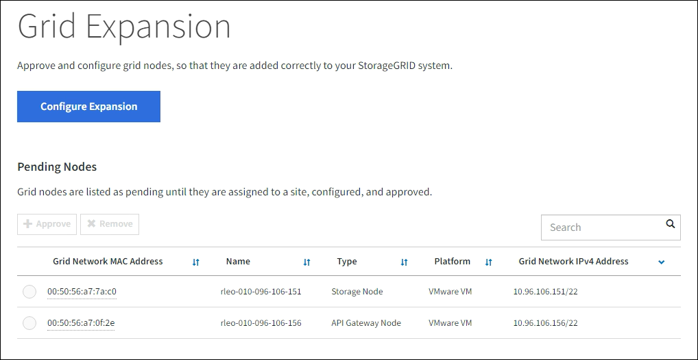

= 執行擴充
:allow-uri-read: 
:icons: font
:imagesdir: ../media/

[role="lead"]
當您執行擴充時，新的網格節點將會新增到您現有的StorageGRID部署中。

.開始之前
* 您已使用link:../admin/web-browser-requirements.html["支援的網頁瀏覽器"]。
* 您有配置密碼。
* 您已部署此擴充功能中新增的所有網格節點。
* 你有link:../admin/admin-group-permissions.html["維護或 Root 存取權限"]。
* 如果您正在新增儲存節點，則您已確認作為復原的一部分執行的所有資料修復作業都已完成。看link:../maintain/checking-data-repair-jobs.html["檢查資料修復作業"] 。
* 如果您正在新增儲存節點，並且想要為這些節點指派自訂儲存等級，那麼您已經link:../ilm/creating-and-assigning-storage-grades.html["建立自訂儲存等級"]。您還擁有 Root 存取權限或維護和 ILM 權限。
* 如果您要新增站點，則您已經查看並更新了 ILM 規則。您必須確保在擴充完成之前，物件副本不會儲存到新網站。例如，如果規則使用預設儲存池（*所有儲存節點*），則必須link:../ilm/creating-storage-pool.html["建立新的儲存池"]僅包含現有儲存節點和link:../ilm/working-with-ilm-rules-and-ilm-policies.html["更新 ILM 規則"]以及使用該新儲存池的 ILM 策略。否則，一旦該站點的第一個節點變為活動狀態，物件就會被複製到新站點。

.關於此任務
執行擴充包括以下主要使用者任務：

. 配置擴充。
. 開始擴展。
. 下載新的復原包檔案。
. 監控擴充步驟和階段，直到所有新節點都安裝和設定完成並且所有服務都已啟動。
+

CAUTION: 一些擴展步驟和階段可能需要花費大量時間才能在大型電網上運作。例如，如果 Cassandra 資料庫為空，則將 Cassandra 串流傳輸到新的儲存節點可能只需幾分鐘。但是，如果 Cassandra 資料庫包含大量物件元數據，則此階段可能需要幾個小時或更長時間。在「擴展 Cassandra 叢集」或「啟動 Cassandra 和流資料」階段，請勿重新啟動任何儲存節點。

.步驟
. 選擇*維護* > *任務* > *擴充*。
+
出現「電網擴充」頁面。待處理節點部分列出了準備新增的節點。

+

. 選擇*配置擴充*。
+
出現“站點選擇”對話框。

. 選擇您要開始的擴充類型：
+
** 如果要新增站點，請選擇“*新建*”，然後輸入新站點的名稱。
** 如果要為現有網站新增一個或多個節點，請選擇「*現有*」。

. 選擇*儲存*。
. 查看*待處理節點*列表，並確認它顯示了您部署的所有網格節點。
+
根據需要，您可以將遊標放在節點的*網格網路 MAC 位址*上以查看有關該節點的詳細資訊。

+
image::../media/grid_node_details.png[網格節點詳細資訊的螢幕截圖]

+

NOTE: 如果缺少節點，請確認該節點是否已成功部署。

. 從待處理節點清單中，批准您想要在此擴充中新增的節點。
+
.. 選擇您要核准的第一個待處理網格節點旁的單選按鈕。
.. 選擇*批准*。
+
出現網格節點配置表單。

.. 根據需要修改常規設定：
+
[cols="1a,2a"]
|===
| 場地 | 描述 

 a| 
地點
 a| 
網格節點將與之關聯的站點的名稱。如果要新增多個節點，請確保為每個節點選擇正確的站點。如果您要新增站點，則所有節點都會新增至新站點。

 a| 
Name
 a| 
節點的系統名稱。系統名稱是內部StorageGRID操作所必需的，並且不能更改。

 a| 
儲存類型（僅限儲存節點）
 a| 
*** *資料和元資料*（「組合」）：物件資料和元資料儲存節點
*** *僅資料*：僅包含物件資料（無元資料）的儲存節點
*** *僅元資料*：僅包含元資料（無物件資料）的儲存節點

 a| 
NTP 角色
 a| 
網格節點的網路時間協定（NTP）角色：

*** 選擇“*自動*”（預設）以自動將 NTP 角色指派給節點。主要角色將指派給管理節點、具有 ADC 服務的儲存節點、網關節點以及任何具有非靜態 IP 位址的網格節點。客戶端角色將被指派給所有其他網格節點。
*** 選擇 *Primary* 手動將主 NTP 角色指派給節點。每個站點至少有兩個節點應具有主要角色，以提供對外部計時來源的冗餘系統存取。
*** 選擇“*客戶端*”以手動將客戶端 NTP 角色指派給節點。

 a| 
ADC 服務（組合或僅元資料儲存節點）
 a| 
此儲存節點是否將執行管理網域控制器 (ADC) 服務。ADC 服務追蹤電網服務的位置和可用性。每個站點至少有三個儲存節點必須包含 ADC 服務。部署 ADC 服務後，您無法將其新增至節點。

*** 如果您要更換的儲存節點包括 ADC 服務，請選擇*是*。因為如果剩餘的 ADC 服務太少，您就無法停用儲存節點，所以這可確保在刪除舊服務之前有新的 ADC 服務可用。
*** 選擇*自動*讓系統確定節點是否需要 ADC 服務。

了解link:../maintain/understanding-adc-service-quorum.html["ADC 仲裁"]。

 a| 
儲存級（組合或僅資料儲存節點）
 a| 
使用*預設*儲存等級，或選擇要指派給此新節點的自訂儲存等級。

儲存等級由 ILM 儲存池使用，因此您的選擇會影響哪些物件將放置在儲存節點上。

|===
.. 根據需要修改網格網路、管理網路和客戶端網路的設定。
+
*** *IPv4 位址 (CIDR)*：網路介面的 CIDR 網路位址。例如：172.16.10.100/24
+

NOTE: 如果您在核准節點時發現網格網路上的節點具有重複的 IP 位址，則必須取消擴展，重新部署具有非重複 IP 的虛擬機器或設備，然後重新開始擴展。

*** *網關*：網格節點的預設閘道。例如：172.16.10.1
*** *子網路（CIDR）*：管理網路的一個或多個子網路。

.. 選擇*儲存*。
+
已核准的網格節點將移至「已核准節點」清單。

+
*** 若要修改已核准的網格節點的屬性，請選擇其單選按鈕，然後選擇*編輯*。
*** 若要將已核准的網格節點移回待處理節點列表，請選擇其單選按鈕，然後選擇*重設*。
*** 若要永久刪除已核准的電網節點，請關閉該節點的電源。然後，選擇其單選按鈕，並選擇*刪除*。

.. 對您想要批准的每個待處理的網格節點重複這些步驟。
+

NOTE: 如果可能的話，您應該批准所有待處理的網格註釋並執行單一擴充。如果進行多次小規模擴展，則需要更多時間。

. 當您批准了所有網格節點後，請輸入*Provisioning Passphrase*，然後選擇*Expand*。
+
幾分鐘後，此頁面將更新以顯示擴充功能的狀態。當影響單一網格節點的任務正在進行時，「網格節點狀態」部分會列出每個網格節點的目前狀態。

+

NOTE: 在新設備的「安裝網格節點」步驟中， StorageGRID設備安裝程式顯示安裝從階段 3 移至階段 4，即完成安裝。當第 4 階段完成後，控制器將重新啟動。

+
image::../media/grid_expansion_progress.png[該圖像由周圍的文字解釋。]

+

NOTE: 站點擴充包括為新站點配置 Cassandra 的額外任務。

. 一旦出現*下載恢復包*鏈接，請下載恢復包文件。
+
對StorageGRID系統進行網格拓撲變更後，您必須盡快下載復原套件檔案的更新副本。如果發生故障，恢復包檔案可讓您恢復系統。

+
.. 選擇下載連結。
.. 輸入設定密碼，然後選擇*開始下載*。
.. 下載完成後，打開 `.zip`文件並確認您可以存取其內容，包括 `Passwords.txt`文件。
.. 複製下載的復原包文件(`.zip`）到兩個安全、可靠且獨立的位置。
+

CAUTION: 復原包檔案必須是安全的，因為它包含可用於從StorageGRID系統取得資料的加密金鑰和密碼。

. 如果您要為現有站點新增儲存節點或新增站點，請監視 Cassandra 階段，這些階段發生在新網格節點上啟動服務時。
+

CAUTION: 在「擴展 Cassandra 叢集」或「啟動 Cassandra 和流資料」階段，請勿重新啟動任何儲存節點。對於每個新的儲存節點，這些階段可能需要花費數小時才能完成，特別是當現有儲存節點包含大量物件元資料時。

+
[role="tabbed-block"]
====
.新增儲存節點
--
如果您要將儲存節點新增至現有站點，請查看「啟動 Cassandra 和流資料」狀態訊息中顯示的百分比。

image::../media/grid_expansion_starting_cassandra.png[網格擴展 > 啟動 Cassandra 和流數據]

此百分比根據可用的 Cassandra 資料總量和已寫入新節點的資料量來估計 Cassandra 流操作的完成程度。

--
.新增站點
--
如果您要新增站點，請使用 `nodetool status`監控 Cassandra 流的進度，並查看在「擴展 Cassandra 叢集」階段有多少元資料被複製到新站點。新站點上的總資料負載應在目前站點總資料負載的 20% 左右以內。

--
====
. 繼續監控擴展，直到所有任務完成並且*配置擴展*按鈕重新出現。

.完成後
根據您新增的網格節點類型，執行額外的整合和設定步驟。看link:configuring-expanded-storagegrid-system.html["擴容後設定步驟"] 。
