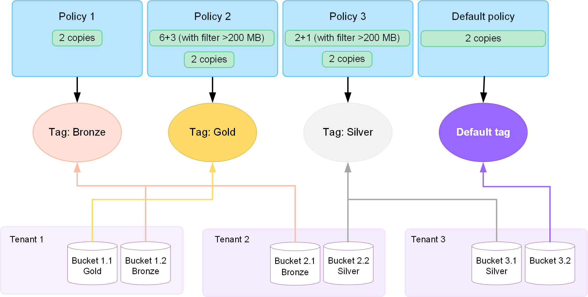

= 使用 ILM 策略
:allow-uri-read: 
:icons: font
:imagesdir: ../media/

[role="lead"]
資訊生命週期管理 (ILM) 策略是一組有序的 ILM 規則，用於確定StorageGRID系統如何隨時間管理物件資料。

CAUTION: 錯誤配置的 ILM 策略可能會導致無法復原的資料遺失。在啟動 ILM 策略之前，請仔細檢查 ILM 策略及其 ILM 規則，然後模擬 ILM 策略。始終確認 ILM 策略能夠如預期般發揮作用。

== 預設 ILM 策略

安裝StorageGRID並新增網站時，會自動建立預設 ILM 策略，如下所示：

* 如果您的網格包含一個站點，則預設策略包含一個預設規則，該規則會在該站點複製每個物件的兩個副本。
* 如果您的網格包含多個站點，則預設規則會在每個站點複製每個物件的副本。

如果預設策略無法滿足您的儲存需求，您可以建立自己的規則和策略。看link:what-ilm-rule-is.html["建立 ILM 規則"]和link:creating-ilm-policy.html["建立 ILM 策略"]。

== 一個或多個有效的 ILM 策略？

您一次可以擁有一個或多個活動的 ILM 策略。

=== 一項政策

如果您的網格將使用具有少量特定於租戶和特定於儲存桶的規則的簡單資料保護方案，請使用單一活動的 ILM 策略。  ILM 規則可以包含過濾器來管理不同的儲存桶或租用戶。

image::../media/ilm-policies-single.png[單一 ILM 策略圖]

當您只有一個策略並且租戶的要求發生變化時，您必須建立新的 ILM 策略或複製現有策略以套用變更、模擬，然後啟動新的 ILM 策略。  ILM 策略的變更可能會導致物件移動需要大量的時間並造成系統延遲。

=== 多項政策

為了向租戶提供不同的服務品質選項，您可以同時擁有多個有效策略。每個策略可以管理特定的租戶、S3 儲存桶和物件。當您針對特定租用戶或物件集套用或變更一個策略時，套用於其他租用戶和物件的策略就不會受到影響。

ILM 策略標籤:: 如果您希望允許租用戶在每個儲存桶的基礎上輕鬆地在多個資料保護策略之間切換，請使用具有_ILM 策略標籤_的多個 ILM 策略。您將每個 ILM 策略指派給一個標籤，然後租用戶標記一個儲存桶以將策略套用至該儲存桶。您只能在 S3 儲存桶上設定 ILM 策略標籤。
+
--
例如，您可能有三個標籤，分別為金、銀和銅。您可以根據策略儲存物件的時間長度和位置為每個標籤指派 ILM 策略。租戶可以透過標記他們的儲存桶來選擇使用哪種策略。標記為「黃金」的儲存桶由「黃金」策略管理，並獲得「黃金」等級的資料保護和效能。

--
預設 ILM 策略標籤:: 安裝StorageGRID時會自動建立預設 ILM 策略標籤。每個網格必須有一個指派給預設標籤的活動策略。預設策略適用於任何未標記的 S3 儲存桶。

== ILM 策略如何評估對象？

主動 ILM 策略控制物件的位置、持續時間和資料保護。

當用戶端將物件儲存到StorageGRID時，將根據策略中有序的 ILM 規則集對物件進行評估，如下所示：

. 如果策略中第一個規則的篩選器與某個物件匹配，則該物件將根據該規則的攝取行為進行攝取，並根據該規則的放置說明進行儲存。
. 如果第一條規則的篩選器與物件不匹配，則根據策略中的每個後續規則評估該對象，直到匹配為止。
. 如果沒有規則與物件匹配，則套用策略中預設規則的攝取行為和放置說明。預設規則是策略中的最後一條規則。預設規則必須適用於所有租用戶、所有 S3 儲存桶和所有物件版本，且不能使用任何進階篩選器。

== ILM 策略範例

例如，ILM 策略可能包含三個 ILM 規則，指定以下內容：

* *規則 1：為租用戶 A 複製副本*
+
** 符合屬於租戶 A 的所有物件。
** 將這些物件作為三個副本儲存在三個站點。
** 屬於其他租戶的物件不符合規則 1，因此根據規則 2 對它們進行評估。

* 規則 2：對大於 1 MB 的物件進行擦除編碼
+
** 匹配來自其他租戶的所有對象，但前提是它們大於 1 MB。這些較大的物件使用 6+3 擦除編碼儲存在三個站點。
** 與 1 MB 或更小的物件不匹配，因此這些物件根據規則 3 進行評估。

* *規則 3：2 個副本 2 個資料中心*（預設）
+
** 是策略中的最後一條規則，也是預設規則。不使用過濾器。
** 對不符合規則 1 或規則 2 的所有物件（不屬於租戶 A 且大小為 1 MB 或更小的物件）製作兩個副本。

image::../media/ilm_policy_and_rules.png[ILM 政策和規則]

== 什麼是有效政策和非有效政策？

每個StorageGRID系統必須至少有一個活動的 ILM 策略。如果您想要擁有多個有效的 ILM 策略，您可以建立 ILM 策略標籤並為每個標籤指派一個策略。然後，租戶將標籤套用到 S3 儲存桶。預設策略適用於未指派策略標籤的儲存桶中的所有物件。

首次建立 ILM 策略時，您可以選擇一個或多個 ILM 規則並按特定順序排列它們。模擬策略以確認其行為後，即可啟動它。

當您啟動 ILM 策略時， StorageGRID會使用該策略來管理所有對象，包括現有對象和新攝取的對象。當實施新策略中的 ILM 規則時，現有物件可能會被移至新位置。

如果您一次啟動多個 ILM 策略，且租用戶將策略標籤套用至 S3 儲存桶，則每個儲存桶中的物件將根據指派給標籤的策略進行管理。

StorageGRID系統追蹤已啟用或停用的策略的歷史記錄。

== 建立 ILM 策略的注意事項

* 在測試系統中僅使用系統提供的策略，即基線 2 份策略。對於StorageGRID 11.6 及更早版本，此原則中的 Make 2 Copies 規則使用包含所有網站的所有儲存節點儲存池。如果您的StorageGRID系統有多個站點，則物件的兩個副本可能會放置在同一個站點上。
+

NOTE: 所有儲存節點儲存池在安裝StorageGRID 11.6 及更早版本期間自動建立。如果升級到更高版本的StorageGRID，所有儲存節點池仍將存在。如果您將StorageGRID 11.7 或更高版本作為新安裝進行安裝，則不會建立所有儲存節點池。

* 在設計新策略時，請考慮可能被納入網格的所有不同類型的物件。確保策略包含按要求匹配和放置這些物件的規則。
* 使 ILM 策略盡可能簡單。這樣可以避免StorageGRID系統隨時間發生更改時物件資料無法得到預期保護的潛在危險情況。
* 確保策略中的規則順序正確。當策略被啟動時，新的和現有的物件將按照列出的順序從頂部開始由規則進行評估。例如，如果策略中的第一個規則與某個物件匹配，則該物件將不會被任何其他規則評估。
* 每個 ILM 策略中的最後一條規則是預設 ILM 規則，它不能使用任何過濾器。如果某個物件尚未與另一個規則匹配，則預設規則控制該物件的放置位置以及保留時間。
* 在啟動新策略之前，請檢查該策略對現有物件的位置所做的任何變更。在評估和實施新位置時，更改現有物件的位置可能會導致臨時資源問題。

