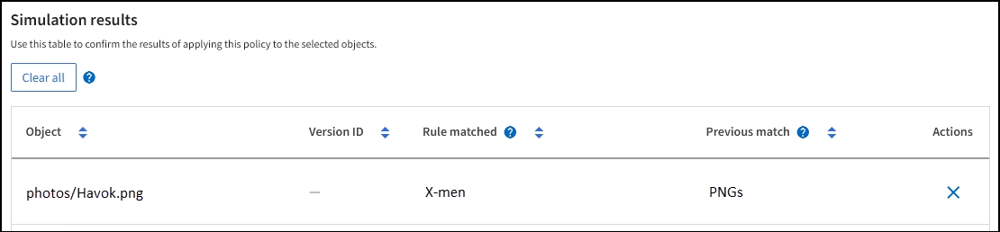

= ILM 策略模擬範例
:allow-uri-read: 
:icons: font
:imagesdir: ../media/

[role="lead"]
ILM 策略模擬的範例為您建立和修改環境模擬提供了指導。

== 範例 1：模擬 ILM 策略時驗證規則

本範例介紹如何在模擬策略時驗證規則。

在此範例中，*範例 ILM 策略*針對兩個儲存桶中攝取的物件進行模擬。該政策包含三條規則，具體如下：

* 第一條規則「*儲存桶 a 的兩份副本，兩年*」僅適用於儲存桶 a 中的物件。
* 第二條規則 *EC 物件 > 1 MB* 適用於所有儲存桶，但會過濾大於 1 MB 的物件。
* 第三條規則「兩個副本，兩個資料中心」是預設規則。它不包含任何過濾器並且不使用非當前參考時間。

模擬策略後，確認每個物件都與正確的規則相符。

image::../media/simulate_policy_screen.png[模擬政策結果]

在此範例中：

* `bucket-a/bucket-a object.pdf`正確匹配了第一條規則，該規則過濾了 `bucket-a`。
* `bucket-b/test object greater than 1 MB.pdf`位於 `bucket-b`，因此它不符合第一條規則。相反，它與第二條規則正確匹配，該規則過濾大於 1 MB 的物件。
* `bucket-b/test object less than 1 MB.pdf`與前兩個規則中的過濾器不匹配，因此它將放置在不包含任何過濾器的預設規則中。

== 範例 2：模擬 ILM 策略時重新排序規則

此範例展示如何在模擬策略時重新排序規則以變更結果。

在此範例中，正在模擬*Demo*策略。此策略旨在尋找具有 series=x-men 使用者元資料的對象，包含以下三個規則：

* 第一條規則 *PNGs* 過濾以以下結尾的鍵名 `.png`。
* 第二條規則 *X-men* 僅適用於租戶 A 的物件和 `series=x-men`用戶元資料。
* 最後一條規則「兩個資料中心的兩個副本」是預設規則，它符合任何與前兩條規則不符的物件。

.步驟
. 新增規則並儲存策略後，選擇*模擬*。
. 在*物件*欄位中，輸入測試物件的 S3 儲存桶/物件鍵並選擇*模擬*。
+
模擬結果顯示 `Havok.png`物件與 *PNGs* 規則相符。

+
image::../media/simulate_reorder_rules_pngs_result.png[範例 2：模擬 ILM 策略時重新排序規則]

+
然而， `Havok.png`是為了測試*X-men*規則。

. 若要解決此問題，請重新排序規則。
+
.. 選擇“*完成*”關閉“模擬 ILM 策略”視窗。
.. 選擇“*編輯*”來編輯該策略。
.. 將 *X-men* 規則拖曳到清單頂部。
.. 選擇*儲存*。

. 選擇*模擬*。
+
您先前測試的物件將根據更新後的策略重新評估，並顯示新的模擬結果。在範例中，規則比對列顯示 `Havok.png`如預期的那樣，物件現在與 X-men 元資料規則相符。上一個符合列顯示 PNG 規則與上一個模擬中的物件相符。

+

== 範例 3：模擬 ILM 策略時修正規則

此範例顯示如何模擬策略、更正策略中的規則並繼續模擬。

在此範例中，正在模擬*Demo*策略。此策略旨在尋找具有 `series=x-men`用戶元資料。然而，在模擬這項政策時出現了意想不到的結果 `Beast.jpg`目的。該物件沒有匹配 X-men 元資料規則，而是匹配了預設規則「兩個副本兩個資料中心」。

image::../media/simulate_results_for_object_wrong_metadata.png[範例 3：模擬 ILM 策略時修正規則]

當測試對象與策略中的預期規則不符時，您必須檢查策略中的每個規則並修正任何錯誤。

.步驟
. 選擇“*完成*”關閉“模擬策略”對話框。在政策的詳細資訊頁面上，選擇*保留圖*。然後根據需要為每個規則選擇*全部展開*或*查看詳細資料*。
. 查看規則的租用戶帳戶、參考時間和篩選條件。
+
例如，假設 X-men 規則的元資料輸入為“x-men01”而不是“x-men”。

. 若要解決該錯誤，請按以下方式修正規則：
+
** 如果該規則是策略的一部分，您可以複製該規則或從策略中刪除該規則，然後對其進行編輯。
** 如果該規則是活動策略的一部分，則必須複製該規則。您無法編輯或刪除活動策略中的規則。

. 再次執行模擬。
+
在這個例子中，修正後的 X-men 規則現在與 `Beast.jpg`對象基於 `series=x-men`用戶元數據，正如預期的那樣。

+
image::../media/simulate_results_for_object_corrected_metadata.png[範例 3：模擬 ILM 策略時修正規則]

