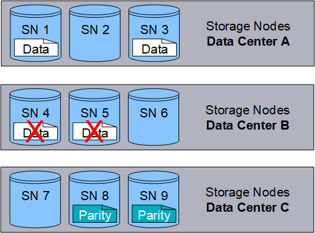

= 什麼是擦除編碼？
:allow-uri-read: 
:icons: font
:imagesdir: ../media/

[role="lead"]
擦除編碼是StorageGRID用於儲存物件資料的兩種方法之一（複製是另一種方法）。當物件與使用擦除編碼的 ILM 規則相符時，這些物件會被切成資料片段，計算額外的奇偶校驗片段，並將每個片段儲存在不同的儲存節點上。

當訪問一個物件時，它會使用儲存的片段重新組裝。如果資料或奇偶校驗片段損壞或遺失，則擦除編碼演算法可以使用剩餘資料和奇偶校驗片段的子集重新建立該片段。

當您建立 ILM 規則時， StorageGRID會建立支援這些規則的擦除編碼設定檔。您可以查看擦除編碼設定檔列表，link:manage-erasure-coding-profiles.html#rename-an-erasure-coding-profile["重命名擦除編碼設定檔"] ， 或者link:manage-erasure-coding-profiles.html#deactivate-an-erasure-coding-profile["如果擦除編碼設定檔目前未在任何 ILM 規則中使用，則停用該設定檔"]。

以下範例說明如何在物件資料上使用擦除編碼演算法。在此範例中，ILM 規則使用 4+2 擦除編碼方案。每個物件被切成四個相等的資料片段，並根據物件資料計算出兩個奇偶校驗片段。六個片段分別儲存在三個資料中心站點的不同節點上，以便在節點故障或站點遺失時提供資料保護。

image::../media/ec_three_sites_4_plus_2.png[擦除編碼三站點 4 加 2]

4+2 擦除編碼方案可以以多種方式配置。例如，您可以設定包含六個儲存節點的單站點儲存池。為了link:using-multiple-storage-pools-for-cross-site-replication.html["站點損失保護"]，您可以使用包含三個網站的儲存池，每個網站有三個儲存節點。只要六個片段（資料或奇偶校驗）中的任四個仍然可用，就可以檢索物件。最多可以遺失兩個片段而不會遺失物件資料。如果整個網站遺失，只要所有其他片段仍然可訪問，仍然可以檢索或修復該物件。

如果遺失兩個以上的儲存節點，則無法檢索物件。

image::../media/ec_unrecoverable_4_plus_2.png[擦除編碼不可恢復 4 加 2]

.相關資訊
* link:what-replication-is.html["什麼是複製"]
* link:what-storage-pool-is.html["什麼是儲存池"]
* link:what-erasure-coding-schemes-are.html["什麼是擦除編碼方案"]
* link:manage-erasure-coding-profiles.html#rename-an-erasure-coding-profile["重命名擦除編碼設定檔"]
* link:manage-erasure-coding-profiles.html#deactivate-an-erasure-coding-profile["停用擦除編碼配置文件"]

