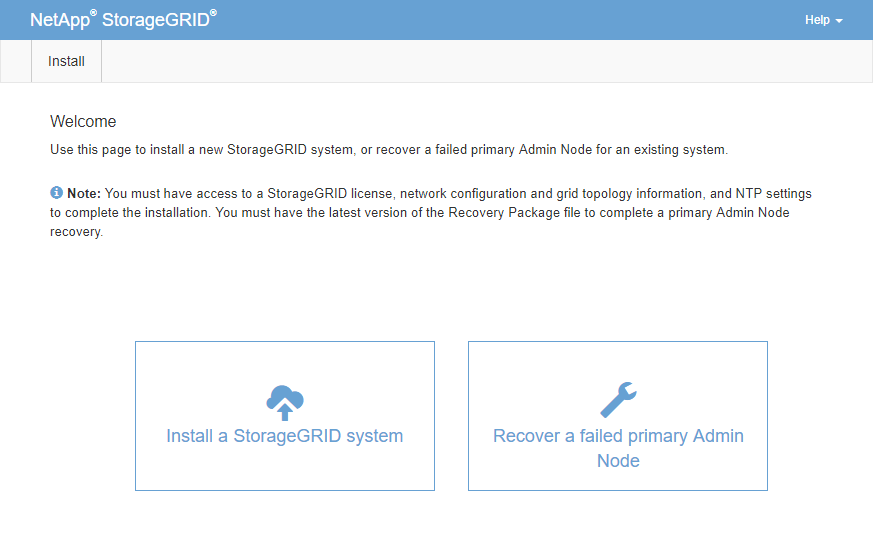

= 配置替換主管理節點
:allow-uri-read: 
:icons: font
:imagesdir: ../media/

[role="lead"]
必須將替換節點配置為StorageGRID系統的主管理節點。

.開始之前
* 對於託管在虛擬機器上的主要管理節點，虛擬機器已部署、啟動並初始化。
* 對於服務設備上託管的主要管理節點，您已更換設備並安裝了軟體。查看 https://docs.netapp.com/us-en/storagegrid-appliances/installconfig/index.html["您的設備的安裝說明"^]。
* 您擁有還原包檔案的最新備份(`sgws-recovery-package-_id-revision_.zip`）。
* 您有配置密碼。

.步驟
. 開啟您的網頁瀏覽器並導航至 `\https://primary_admin_node_ip`。
. 根據需要管理臨時安裝程序密碼：
+
** 如果已經使用其中一種方法設定了密碼，請輸入密碼以繼續。
+
*** 用戶之前在訪問安裝程式時設定了密碼
*** 對於裸機系統，密碼會自動從節點設定檔匯入 `/etc/storagegrid/nodes/_<node_name>_.conf`
*** 對於虛擬機，SSH/控制台密碼已從 OVF 屬性自動匯入

** 如果尚未設定密碼，則可以選擇設定密碼以保護StorageGRID安裝程式。

. 點選*恢復失敗的主管理節點*。
+

. 上傳恢復包的最新備份：
+
.. 按一下“瀏覽”。
.. 找到StorageGRID系統的最新恢復包文件，然後按一下「開啟」。

. 輸入配置密碼。
. 按一下“開始恢復”。
+
恢復過程開始。當所需服務啟動時，網格管理器可能會在幾分鐘內變得不可用。恢復完成後，將顯示登入頁面。

. 如果您的StorageGRID系統啟用了單一登入 (SSO)，且您復原的管理節點的信賴方信任已配置為使用預設管理介面​​證書，請在 Active Directory 聯合驗證服務 (AD FS) 中更新（或刪除並重新建立）該節點的信賴方信任。使用管理節點復原過程中產生的新的預設伺服器憑證。
+

NOTE: 若要配置信賴方信任，請參閱link:../admin/configuring-sso.html["配置單一登入"]。若要存取預設伺服器證書，請登入管理節點的命令 shell。前往 `/var/local/mgmt-api`目錄，然後選擇 `server.crt`文件。

CAUTION: 恢復主管理節點後，link:assess-hotfix-requirement-during-primary-admin-node-recovery.html["確定是否需要應用修補程序"] 。
