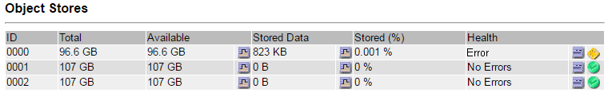

= 識別並解除安裝故障儲存卷
:allow-uri-read: 
:icons: font
:imagesdir: ../media/

[role="lead"]
恢復具有故障儲存磁碟區的儲存節點時，必須識別並卸載故障磁碟區。您必須驗證只有發生故障的儲存磁碟區會作為復原過程的一部分重新格式化。

.開始之前
您已使用link:../admin/web-browser-requirements.html["支援的網頁瀏覽器"]。

.關於此任務
您應該盡快恢復失敗的儲存磁碟區。

復原過程的第一步是偵測已分離、需要卸載或存在 I/O 錯誤的磁碟區。如果故障磁碟區仍然連接但具有隨機損壞的檔案系統，則系統可能無法偵測到磁碟未使用或未指派部分的任何損壞。

NOTE: 您必須先完成此過程，然後才能執行手動步驟來還原卷，例如新增或重新連接磁碟、停止節點、啟動節點或重新啟動。否則，當您運行 `reformat_storage_block_devices.rb`腳本，您可能會遇到導致腳本掛起或失敗的檔案系統錯誤。

NOTE: 修復硬體並正確連接磁碟，然後再運行 `reboot`命令。

CAUTION: 仔細識別故障的儲存卷。您將使用此資訊來驗證哪些磁碟區必須重新格式化。卷重新格式化後，磁碟區上的資料將無法復原。

要正確復原故障儲存卷，您需要知道故障儲存卷的裝置名稱及其磁碟區 ID。

安裝時，每個儲存裝置都會指派一個檔案系統通用唯一識別碼 (UUID)，並使用該指派的檔案系統 UUID 安裝到儲存節點上的 rangedb 目錄。檔案系統 UUID 和 rangedb 目錄列在 `/etc/fstab`文件。裝置名稱、rangedb 目錄和已安裝磁碟區的大小顯示在網格管理員中。

在以下範例中，設備 `/dev/sdc`磁碟區大小為 4 TB，安裝到 `/var/local/rangedb/0`，使用設備名稱 `/dev/disk/by-uuid/822b0547-3b2b-472e-ad5e-e1cf1809faba`在/`etc/fstab`文件：

image::../media/mounting_storage_devices.gif[卷大小範例]

.步驟
. 完成以下步驟來記錄故障儲存磁碟區及其裝置名稱：
+
.. 選擇*支援* > *工具* > *網格拓撲*。
.. 選擇 *site* > *failed Storage Node* > *LDR* > *Storage* > *Overview* > *Main*，然後尋找帶有警報的物件儲存。
+

.. 選擇 *網站* > *故障儲存節點* > *SSM* > *資源* > *概覽* > *主要*。決定上一個步驟中識別的每個故障儲存磁碟區的掛載點和磁碟區大小。
+
物件儲存以十六進位表示法編號。例如，0000 是第一卷，000F 是第十六卷。範例中，ID 為 0000 的物件儲存對應 `/var/local/rangedb/0`設備名稱為 sdc，大小為 107 GB。

+
image::../media/ssm_storage_volumes.gif[顯示物件儲存和掛載點的範例]

. 登入發生故障的儲存節點：
+
.. 輸入以下命令： `ssh admin@_grid_node_IP_`
.. 輸入 `Passwords.txt`文件。
.. 輸入以下命令切換到root： `su -`
.. 輸入 `Passwords.txt`文件。

+
當您以 root 身分登入時，提示字元將從 `$`到 `#`。

. 執行以下腳本來卸載故障的儲存磁碟區：
+
`sn-unmount-volume object_store_ID`

+
這 `object_store_ID`是故障儲存磁碟區的 ID。例如，指定 `0`在 ID 為 0000 的物件儲存的命令中。

. 如果出現提示，請按 *y* 停止依賴儲存磁碟區 0 的 Cassandra 服務。
+

NOTE: 如果 Cassandra 服務已停止，則不會提示您。  Cassandra 服務僅針對磁碟區 0 停止。

+
[listing]
----
root@Storage-180:~/var/local/tmp/storage~ # sn-unmount-volume 0
Services depending on storage volume 0 (cassandra) aren't down.
Services depending on storage volume 0 must be stopped before running this script.
Stop services that require storage volume 0 [y/N]? y
Shutting down services that require storage volume 0.
Services requiring storage volume 0 stopped.
Unmounting /var/local/rangedb/0
/var/local/rangedb/0 is unmounted.
----
+
幾秒鐘後，該卷就被卸載了。出現的訊息指示了該過程的每個步驟。最後一條訊息表示該磁碟區已卸載。

. 如果由於磁碟區繁忙而導致卸載失敗，您可以使用 `--use-umountof`選項：
+

NOTE: 使用 `--use-umountof`選項可能會導致使用該磁碟區的進程或服務出現異常行為或崩潰。

+
[listing]
----
root@Storage-180:~ # sn-unmount-volume --use-umountof /var/local/rangedb/2
Unmounting /var/local/rangedb/2 using umountof
/var/local/rangedb/2 is unmounted.
Informing LDR service of changes to storage volumes
----

