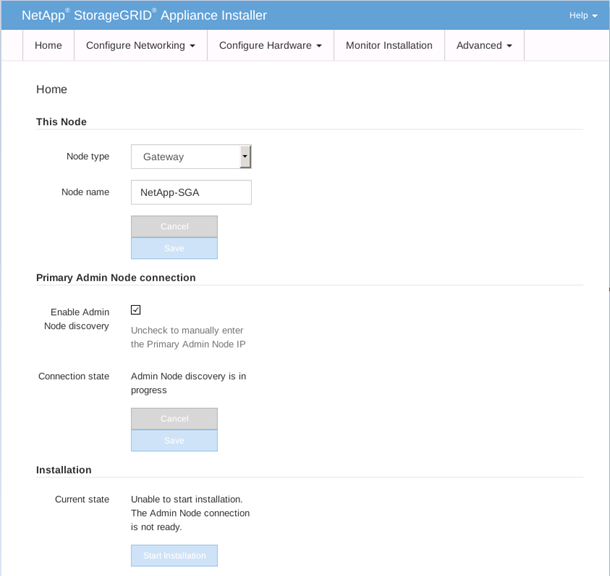

= 在服務設備上開始軟體安裝
:allow-uri-read: 
:icons: font
:imagesdir: ../media/

[role="lead"]
若要在服務設備上安裝網關節點或管理節點，請使用設備中包含的StorageGRID設備安裝程式。

.開始之前
* 本設備安裝在機架中，連接到您的網路並打開電源。
* 使用StorageGRID設備安裝程式為設備設定網路連結和 IP 位址。
* 如果您正在安裝網關節點或非主管理節點，則您知道StorageGRID網格的主管理節點的 IP 位址。
* StorageGRID設備安裝程式的 IP 設定頁面上所列的所有網格網路子網路均在主管理節點上的網格網路子網路清單中定義。
+
看 https://docs.netapp.com/us-en/storagegrid-appliances/installconfig/index.html["硬體安裝快速啟動"^]。

* 您正在使用link:../admin/web-browser-requirements.html["支援的網頁瀏覽器"]。
* 您已將其中一個 IP 位址指派給該裝置。您可以使用管理網路、網格網路或用戶端網路的 IP 位址。
* 如果您正在安裝主管理節點，則可以使用此版本StorageGRID的 Ubuntu 或 Debian 安裝檔案。
+

NOTE: 在製造過程中，最新版本的StorageGRID軟體已預先安裝到服務設備上。如果預先安裝的軟體版本與StorageGRID部署中使用的版本相匹配，則不需要安裝檔案。

.關於此任務
若要在服務設備上安裝StorageGRID軟體：

* 對於主管理節點，您可以指定節點的名稱，然後上傳適當的軟體包（如果需要）。
* 對於非主管理節點或網關節點，您可以指定或確認主管理節點的 IP 位址和節點名稱。
* 您開始安裝並等待磁碟區配置和軟體安裝。
* 安裝過程進行到一半時暫停。若要恢復安裝，您必須登入網格管理器並將待處理節點配置為故障節點的替代節點。
* 配置節點後，設備安裝過程完成，且設備重新啟動。

.步驟
. 開啟瀏覽器並輸入服務設備的其中一個 IP 位址。
+
`https://_Controller_IP_:8443`

+
出現StorageGRID Appliance Installer 首頁。

+

. 若要安裝主管理節點：
+
.. 在此節點部分中，對於*節點類型*，選擇*主管理員*。
.. 在「*節點名稱*」欄位中，輸入與要復原的節點相同的名稱，然後按一下「*儲存*」。
.. 在「安裝」部分中，檢查「目前狀態」下列出的軟體版本
+
如果準備安裝的軟體版本正確，請跳至<<installation_section_step,安裝步驟>>。

.. 如果您需要上傳不同版本的軟體，請在*進階*選單下選擇*上傳StorageGRID軟體*。
+
出現「上傳StorageGRID軟體」頁面。

+
image::../media/upload_sw_for_pa_on_sga1000.png[螢幕截圖周圍有文字描述]

.. 按一下「瀏覽」上傳StorageGRID軟體的「軟體包」和「校驗和檔案」。
+
選擇檔案後，它們會自動上傳。

.. 按一下「*首頁*」返回StorageGRID Appliance Installer 主頁。

. 若要安裝網關節點或非主管理節點：
+
.. 在“此節點”部分中，對於“*節點類型*”，選擇“*網關*”或“*非主管理員*”，取決於您要恢復的節點類型。
.. 在「*節點名稱*」欄位中，輸入與要復原的節點相同的名稱，然後按一下「*儲存*」。
.. 在主管理節點連線部分，確定是否需要指定主管理節點的 IP 位址。
+
假設主管理節點或至少一個配置了 ADMIN_IP 的其他網格節點位於同一子網路上， StorageGRID設備安裝程式可以自動發現此 IP 位址。

.. 如果未顯示此 IP 位址或您需要變更它，請指定位址：

+
[cols="1a,2a"]
|===
| 選項 | 描述 

 a| 
手動 IP 輸入
 a| 
.. 清除「啟用管理節點發現」複選框。
.. 手動輸入 IP 位址。
.. 點選“儲存”。
.. 等待新 IP 位址的連線狀態變為「就緒」。

 a| 
自動發現所有已連線的主要管理節點
 a| 
.. 選取「啟用管理節點發現」複選框。
.. 從發現的 IP 位址清單中，選擇將部署此服務設備的網格的主管理節點。
.. 點選“儲存”。
.. 等待新 IP 位址的連線狀態變為「就緒」。

|===
. [[installation_section_step]]在安裝部分，確認目前狀態為準備開始安裝節點名稱，並且*開始安裝*按鈕已啟用。
+
如果未啟用「*開始安裝*」按鈕，您可能需要變更網路設定或連接埠設定。有關說明，請參閱設備的維護說明。

. 在StorageGRID Appliance Installer 主頁上，按一下 *開始安裝*。
+
目前狀態變為“安裝正在進行中”，並顯示監控安裝頁面。

+

NOTE: 如果需要手動存取「監視器安裝」頁面，請點選功能表列中的「*監視器安裝*」。

