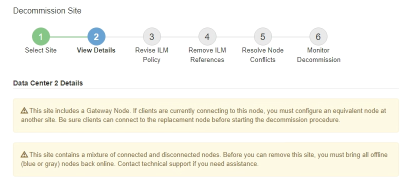

= 第 2 步：查看詳細信息
:allow-uri-read: 
:icons: font
:imagesdir: ../media/

[role="lead"]
從退役網站精靈的第 2 步（查看詳細資料）中，您可以查看網站中包含哪些節點，查看每個儲存節點上已使用的空間量，並評估網格中其他網站有多少可用空間。

.開始之前
在退役某個網站之前，您必須檢查該網站上存在多少物件資料。

* 如果您正在執行連線網站退役，則必須在更新 ILM 之前了解網站上目前存在多少物件資料。根據網站容量和資料保護需求，您可以建立新的 ILM 規則以將資料移至其他網站或從網站刪除物件資料。
* 如果可能，請在開始退役程式之前執行任何所需的儲存節點擴充。
* 如果您正在執行斷開連線的網站退役，則必須了解在刪除網站後有多少物件資料將永久無法存取。

CAUTION: 如果您正在執行斷開連線的網站退役，ILM 無法移動或刪除物件資料。留在站點的所有資料都將遺失。但是，如果您的 ILM 策略旨在防止單一網站遺失，則物件資料的副本仍然存在於其餘網站上。看link:../ilm/using-multiple-storage-pools-for-cross-site-replication.html["啟用網站遺失保護"] 。

.步驟
. 從步驟 2（查看詳細資訊）開始，查看與您選擇刪除的網站相關的所有警告。
+

+
在以下情況下會出現警告：

+
** 該站點包括一個網關節點。如果 S3 用戶端目前正在連接到此節點，則必須在另一個站點配置等效節點。在繼續退役程序之前，請確保用戶端可以連接到替換節點。
** 該站點包含連接的混合（image:../media/icon_alert_green_checkmark.png["圖示警報綠色複選標記"] ) 和斷開的節點 (image:../media/icon_alarm_gray_administratively_down.png["圖示警報灰色管理關閉"]或者image:../media/icon_alarm_blue_unknown.png["圖標警報藍色未知"]）。刪除此網站之前，您必須先將所有離線節點重新連線。

. 查看您選擇刪除的網站的詳細資訊。
+
image::../media/decommission_site_step_2_view_details.png[退役場地第 2 步驟查看詳情]

+
所選站點包含以下資訊：

+
** 節點數
** 站點中所有儲存節點的總已使用空間、可用空間和容量。
+
*** 對於已連接站點的退役，「已使用空間」值表示必須將多少物件資料移至其他站點或使用 ILM 刪除。
*** 對於已斷開連線的網站退役，「已使用空間」值表示當您刪除該網站時，有多少物件資料將變得無法存取。

** 節點名稱、類型和連線狀態：
+
*** image:../media/icon_alert_green_checkmark.png["圖示警報綠色複選標記"]（已連接）
*** image:../media/icon_alarm_gray_administratively_down.png["圖示警報灰色管理關閉"]（管理向下）
*** image:../media/icon_alarm_blue_unknown.png["圖標警報藍色未知"]（未知）

** 每個節點的詳細資訊：
+
*** 對於每個儲存節點，已用於物件資料的空間量。
*** 對於管理節點和網關節點，該節點目前是否在高可用性 (HA) 群組中使用。您無法停用 HA 群組中使用的管理節點或網關節點。在開始退役之前，請編輯 HA 群組以刪除網站上的所有節點，或者如果 HA 群組僅包含來自該網站的節點，則刪除該 HA 群組。有關說明，請參閱link:../admin/managing-high-availability-groups.html["管理高可用性 (HA) 組"]。

. 在頁面的「其他網站的詳細資料」部分中，評估網格中其他網站的可用空間量。
+
image::../media/decommission_site_step_2_view_details_for_other_sites.png[退役站點第 2 步查看其他站點的詳細信息]

+
如果您正在執行已連接站點的退役，並且計劃使用 ILM 從選定站點移動對象數據（而不是僅僅刪除它），則必須確保其他站點有足夠的容量來容納移動的數據，並且有足夠的容量來滿足未來的增長。

+

NOTE: 如果要刪除的網站的*已用空間*大於*其他網站的總可用空間*，則會出現警告。為了確保在刪除網站後有足夠的儲存容量，您可能需要在執行此程序之前進行擴充。

. 選擇“下一步”。
+
出現步驟 3（修改 ILM 策略）。

