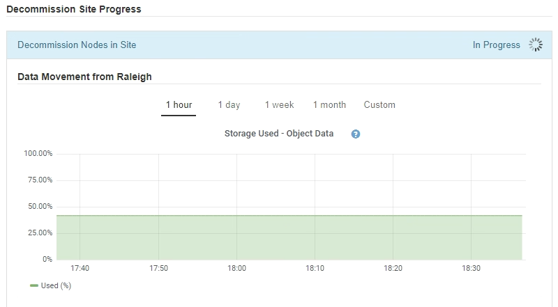

= 步驟 6：監控退役
:allow-uri-read: 
:icons: font
:imagesdir: ../media/

[role="lead"]
從退役網站頁面精靈的第 6 步驟（監視退役）開始，您可以監視網站移除的進度。

.關於此任務
當StorageGRID刪除已連接的站點時，它會按以下順序刪除節點：

. 閘道
. 管理節點
. 儲存節點

當StorageGRID刪除已斷開連接的網站時，它會以下列順序刪除節點：

. 閘道
. 儲存節點
. 管理節點

每個網關節點或管理節點可能只需要幾分鐘或一個小時即可刪除；但是，儲存節點可能需要幾天或幾週的時間。

.步驟
. 一旦產生新的恢復包，請下載該檔案。
+
image::../media/decommission_site_step_6_recovery_package.png[站點退役第 6 步恢復包]

+

NOTE: 盡快下載恢復包，以確保在退役過程中出現問題時可以恢復電網。

+
.. 選擇訊息中的鏈接，或選擇*維護* > *系統* > *恢復包*。
.. 下載 `.zip`文件。
+
請參閱說明link:downloading-recovery-package.html["下載恢復包"]。

+

NOTE: 復原包檔案必須是安全的，因為它包含可用於從StorageGRID系統取得資料的加密金鑰和密碼。

. 使用資料移動圖表，監控物件資料從該網站到其他站點的移動。
+
當您在步驟 3（修改 ILM 策略）中啟動新的 ILM 策略時，資料移動就開始了。資料移動將在整個退役過程中發生。

+

. 在頁面的節點進度部分，監控節點移除過程中退役過程的進度。
+
當儲存節點被移除時，每個節點都會經歷一系列階段。儘管大多數階段都發生得很快甚至難以察覺，但根據需要移動的資料量，您可能需要等待幾天甚至幾週才能完成其他階段。需要額外的時間來管理擦除編碼資料並重新評估 ILM。

+
image::../media/decommission_site_step_6_storage_node.png[退役站點第 6 步驟儲存節點]

+
如果您正在監控已連接站點退役的進度，請參閱此表以了解儲存節點的退役階段：

+
[cols="1a,2a"]
|===
| 階段 | 預計持續時間 

 a| 
待辦的
 a| 
分鐘或更短

 a| 
等待鎖
 a| 
分分鐘

 a| 
準備任務
 a| 
分鐘或更短

 a| 
標記 LDR 已退役
 a| 
分分鐘

 a| 
停用複製和擦除編碼數據
 a| 
根據資料量，以小時、天或週為單位

*注意*：如果您需要執行其他維護活動，您可以在此階段暫停站點退役。

 a| 
LDR 設定狀態
 a| 
分分鐘

 a| 
刷新審計隊列
 a| 
根據訊息數量和網路延遲，需要幾分鐘到幾小時。

 a| 
完全的
 a| 
分分鐘

|===
+
如果您正在監控斷開連線的網站退役的進度，請參考此表以了解儲存節點的退役階段：

+
[cols="1a,1a"]
|===
| 階段 | 預計持續時間 

 a| 
待辦的
 a| 
分鐘或更短

 a| 
等待鎖
 a| 
分分鐘

 a| 
準備任務
 a| 
分鐘或更短

 a| 
禁用外部服務
 a| 
分分鐘

 a| 
憑證吊銷
 a| 
分分鐘

 a| 
節點註銷
 a| 
分分鐘

 a| 
儲存等級取消註冊
 a| 
分分鐘

 a| 
儲存組刪除
 a| 
分分鐘

 a| 
實體移除
 a| 
分分鐘

 a| 
完全的
 a| 
分分鐘

|===
. 所有節點都達到完成階段後，等待剩餘的站點退役作業完成。
+
** 在*修復 Cassandra* 步驟中， StorageGRID會對網格中剩餘的 Cassandra 叢集進行任何必要的修復。這些修復可能需要幾天或更長時間，具體取決於網格中剩餘的儲存節點數量。
+
image::../media/decommission_site_step_6_repair_cassandra.png[退役站點第 6 步修復 Cassandra]

** 在*停用 EC 設定檔和刪除儲存池*步驟中，會進行以下 ILM 變更：
+
*** 任何涉及該網站的擦除編碼設定檔都將被停用。
*** 引用該網站的所有儲存池都將被刪除。
+

NOTE: 所有儲存節點儲存池（StorageGRID 11.6 及更早版本）也被刪除，因為它使用所有網站網站。

** 最後，在*刪除配置*步驟中，對網站及其節點的任何剩餘引用都將從網格的其餘部分中刪除。
+
image::../media/decommission_site_step_6_remove_configuration.png[退役站點步驟 6 刪除配置]

. 退役程序完成後，「退役網站」頁面將顯示成功訊息，並且不再顯示已刪除的網站。
+
image::../media/decommission_site_success_message.png[退役站點成功訊息]

.完成後
完成站點退役程序後，完成以下任務：

* 確保退役站點中所有儲存節點的磁碟機均已清除。使用市售的資料擦除工具或服務永久安全地從磁碟機中刪除資料。
* 如果網站包含一個或多個管理節點，且您的StorageGRID系統啟用了單一登入 (SSO)，請從 Active Directory 聯合驗證服務 (AD FS) 中刪除該網站的所有信賴方信任。
* 作為連接站點退役過程的一部分，節點自動正常關閉後，刪除相關的虛擬機器。

