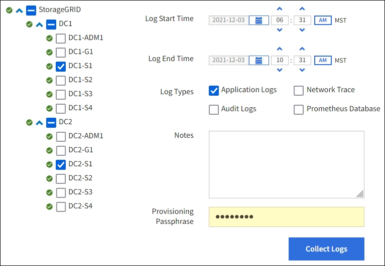

= 收集日誌檔案和系統數據
:allow-uri-read: 
:icons: font
:imagesdir: ../media/

[role="lead"]
您可以使用網格管理器檢索StorageGRID系統的日誌檔案和系統資料（包括設定資料）。

.開始之前
* 您必須使用link:../admin/web-browser-requirements.html["支援的網頁瀏覽器"]。
* 你有link:../admin/admin-group-permissions.html["特定存取權限"]。
* 您必須擁有設定密碼。

.關於此任務
您可以使用網格管理器來收集link:logs-files-reference.html["紀錄檔案"]、系統資料和來自任何網格節點的您選擇的時間段的配置資料。資料被收集並存檔在 .tar.gz 檔案中，然後您可以將其下載到本機。

或者，您可以變更稽核日誌的目標並將稽核資訊傳送至外部系統日誌伺服器。當設定外部系統日誌伺服器時，將繼續產生和儲存稽核記錄的本機日誌。看link:../monitor/configure-audit-messages.html["配置審計訊息和日誌目標"] 。

.步驟
. 選擇 *支援* > *工具* > *日誌*。
+

. 選擇要收集日誌檔案的網格節點。
+
根據需要，您可以收集整個網格或整個資料中心網站的日誌檔案。

. 選擇*開始時間*和*結束時間*來設定日誌檔案中包含的資料的時間範圍。
+
如果您選擇很長的時間段或從大型網格中的所有節點收集日誌，則日誌存檔可能會變得太大而無法儲存在節點上，或者太大而無法收集到主管理節點進行下載。如果發生這種情況，您必須使用較小的資料集重新開始日誌收集。

. 選擇您想要收集的日誌類型。
+
** *應用程式日誌*：技術支援最常用於故障排除的特定於應用程式的日誌。收集的日誌是可用應用程式日誌的子集。
** *稽核日誌*：包含系統正常運作期間產生的稽核訊息的日誌。
** *網路追蹤*：用於網路偵錯的日誌。
** *Prometheus 資料庫*：來自所有節點上的服務的時間序列指標。

. 或者，在 *Notes* 文字方塊中輸入有關您收集的日誌檔案的註解。
+
您可以使用這些註釋來向技術支援提供有關促使您收集日誌檔案的問題的資訊。您的筆記已新增至名為 `info.txt`以及有關日誌檔案收集的其他資訊。這 `info.txt`文件保存在日誌文件歸檔包中。

. 在 *Provisioning Passphrase* 文字方塊中輸入StorageGRID系統的設定密碼。
. 選擇*收集日誌*。
+
當您提交新請求時，先前的日誌檔案集合將被刪除。

+
您可以使用日誌頁面來監控每個網格節點的日誌檔案收集進度。

+
如果您收到有關日誌大小的錯誤訊息，請嘗試收集更短時間段或更少節點的日誌。

. 日誌檔案收集完成後選擇*下載*。
+
_.tar.gz_ 檔案包含所有成功收集日誌的網格節點的所有日誌檔案。在組合的 _.tar.gz_ 檔案中，每個網格節點都有一個日誌檔案存檔。

.完成後
如果需要，您可以稍後重新下載日誌檔案存檔套件。

或者，您可以選擇“*刪除*”來刪除日誌檔案存檔包並釋放磁碟空間。下次收集日誌檔案時，目前日誌檔案歸檔包將會自動刪除。
