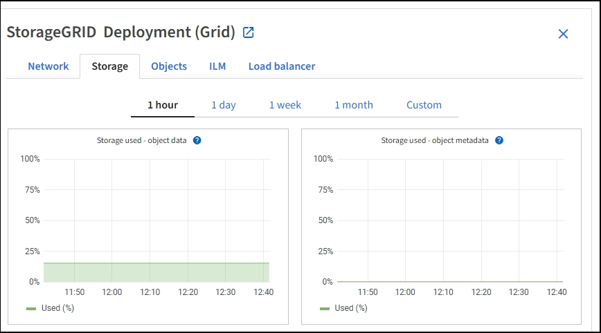

= 監控儲存容量
:allow-uri-read: 
:icons: font
:imagesdir: ../media/

[role="lead"]
監控可用的總空間，以確保StorageGRID系統不會耗盡物件或物件元資料的儲存空間。

StorageGRID分別儲存物件資料和物件元數據，並為包含物件元資料的分散式 Cassandra 資料庫保留特定大小的空間。監控物件和物件元資料所消耗的總空間量，以及每個空間消耗量的趨勢。這將使您能夠提前規劃新增節點並避免任何服務中斷。

你可以link:viewing-storage-tab.html["查看儲存容量資訊"]針對整個網格、每個站點以及StorageGRID系統中的每個儲存節點。

== 監控整個電網的儲存容量

監控網格的整體儲存容量，以確保有足夠的可用空間用於物件資料和物件元資料。了解儲存容量如何隨時間變化可以幫助您在網格的可用儲存容量被消耗之前規劃新增儲存節點或儲存磁碟區。

網格管理器儀表板可讓您快速評估整個網格和每個資料中心可用的儲存空間。節點頁面提供了物件資料和物件元資料的更詳細值。

.步驟
. 評估整個電網和每個資料中心有多少可用儲存空間。
+
.. 選擇“儀表板”>“概覽”。
.. 注意資料空間使用情況細分和元資料允許空間使用情況細分卡上的值。每張卡片列出了儲存使用率、已使用空間容量以及網站可用或允許的總空間。
+

NOTE: 摘要不包括檔案媒體。

+
image::../media/dashboard_data_and_metadata_space_usage_breakdown.png[資料和元資料空間使用情況明細]

.. 請注意隨時間變化的記憶卡上的圖表。使用時間段下拉式選單來幫助您確定儲存消耗的速度。
+
image::../media/dashboard_storage_over_time.png[儲存隨時間變化的圖表]

. 使用「節點」頁面可以了解有關已使用多少儲存空間以及網格上還有多少儲存空間可用於物件資料和物件元資料的更多詳細資訊。
+
.. 選擇*NODES*。
.. 選擇*_grid_* > *儲存*。
+

.. 將遊標放在*已使用儲存 - 物件資料*和*已使用儲存 - 物件元資料*圖表上，查看整個網格可用的物件儲存和物件元資料儲存量，以及隨時間推移已用儲存量。
+

NOTE: 站點或網格的總值不包括至少五分鐘未報告指標的節點，例如離線節點。

. 計劃在網格的可用儲存容量被消耗之前執行擴充以新增儲存節點或儲存磁碟區。
+
在規劃擴充時間時，請考慮購買和安裝額外儲存需要多長時間。

+

NOTE: 如果您的 ILM 策略使用擦除編碼，您可能更願意在現有儲存節點約 70% 滿時進行擴展，以減少必須新增的節點數量。

+
有關規劃存儲擴展的更多信息，請參閱link:../expand/index.html["擴充StorageGRID的說明"]。

== 監控每個儲存節點的儲存容量

監控每個儲存節點的總可用空間，以確保節點有足夠的空間容納新的物件資料。

.關於此任務
可用空間是可用於儲存物件的儲存空間量。儲存節點的總可用空間是透過將節點內所有物件儲存的可用空間加在一起來計算的。

image::../media/calculating_watermarks.gif[總可用空間概念圖]

.步驟
. 選擇 *NODES* > *_Storage Node_* > *Storage*。
+
出現該節點的圖形和表格。

. 將遊標放在使用的儲存空間 - 物件資料圖上。
+
顯示以下值：

+
** *已使用（％）*：已用於物件資料的總可用空間的百分比。
** *已使用*：已用於物件資料的總可用空間量。
** *複製資料*：此節點、站點或網格上複製的物件資料量的估計值。
** *清除編碼資料*：此節點、網站或網格上清除編碼物件資料量的估計值。
** *總計*：此節點、站點或網格上可用空間的總量。使用值是 `storagegrid_storage_utilization_data_bytes`公制。
+
image::../media/nodes_page_storage_used_object_data.png[節點頁面儲存使用物件數據]

. 查看圖表下方的磁碟區和物件儲存表中的可用值。
+

NOTE: 若要查看這些值的圖表，請點擊圖表圖標image:../media/icon_chart_new_for_11_5.png["圖表圖標"]在可用列中。

+
image::../media/nodes_page_storage_tables.png[物件儲存表]

. 監控一段時間內的值以估計可用儲存空間的消耗率。
. 為了維持正常的系統操作，請在可用空間耗盡之前新增儲存節點、新增儲存磁碟區或存檔物件資料。
+
在規劃擴充時間時，請考慮購買和安裝額外儲存需要多長時間。

+

NOTE: 如果您的 ILM 策略使用擦除編碼，您可能更願意在現有儲存節點約 70% 滿時進行擴展，以減少必須新增的節點數量。

+
有關規劃存儲擴展的更多信息，請參閱link:../expand/index.html["擴充StorageGRID的說明"]。

+
這link:../troubleshoot/troubleshooting-low-object-data-storage-alert.html["低對象資料存儲"]當儲存節點上儲存物件資料的空間不足時，會觸發警報。

== 監控每個儲存節點的物件元資料容量

監控每個儲存節點的元資料使用情況，以確保有足夠的空間可用於基本資料庫操作。在物件元資料超過允許的元資料空間的 100% 之前，必須在每個站點新增新的儲存節點。

.關於此任務
StorageGRID在每個站點維護三個物件元資料的副本，以提供冗餘並保護物件元資料免於遺失。這三個副本均勻分佈在每個站點的所有儲存節點上，使用每個儲存節點的儲存磁碟區 0 上為元資料保留的空間。

在某些情況下，網格的物件元資料容量可能比其物件儲存容量消耗得更快。例如，如果您通常攝取大量小對象，則可能需要新增儲存節點來增加元資料容量，即使剩餘足夠的對象儲存容量。

一些可以增加元資料使用量的因素包括使用者元資料和標籤的大小和數量、分段上傳中的部分總數以及 ILM 儲存位置的變更頻率。

.步驟
. 選擇 *NODES* > *_Storage Node_* > *Storage*。
. 將遊標放在使用的儲存空間 - 物件元資料圖上以查看特定時間的值。
+
image::../media/storage_used_object_metadata.png[已用儲存 - 物件元數據]

+
用過的 （％）:: 此儲存節點上已使用的允許元資料空間的百分比。
+
--
Prometheus 指標： `storagegrid_storage_utilization_metadata_bytes`和 `storagegrid_storage_utilization_metadata_allowed_bytes`

--
用過的:: 此儲存節點上已使用的允許元資料空間的位元組數。
+
--
Prometheus 指標： `storagegrid_storage_utilization_metadata_bytes`

--
允許:: 此儲存節點上允許的物件元資料的空間。若要了解如何確定每個儲存節點的該值，請參閱link:../admin/managing-object-metadata-storage.html#allowed-metadata-space["允許元資料空間的完整描述"]。
+
--
Prometheus 指標： `storagegrid_storage_utilization_metadata_allowed_bytes`

--
實際預留:: 此儲存節點上為元資料保留的實際空間。包括允許的空間和基本元資料操作所需的空間。若要了解如何為每個儲存節點計算此值，請參閱link:../admin/managing-object-metadata-storage.html#actual-reserved-space-for-metadata["元資料實際保留空間的完整描述"]。
+
--
_Prometheus 指標將在未來的版本中添加。 _

--

+

NOTE: 站點或網格的總值不包括至少五分鐘未報告指標的節點，例如離線節點。

. 如果*已使用（％）*值為 70％ 或更高，請透過向每個網站新增儲存節點來擴充您的StorageGRID系統。
+

CAUTION: 當*已使用（％）*值達到某些閾值時，會觸發*低元資料儲存*警報。如果物件元資料使用超過 100% 的允許空間，則可能會出現不良結果。

+
當您新增節點時，系統會自動重新平衡網站內所有儲存節點的物件元資料。查看link:../expand/index.html["擴充StorageGRID系統的說明"]。

== 監控空間使用率預測

監控使用者資料和元資料的空間使用預測，以估計何時需要link:../expand/index.html["展開網格"]。

如果您注意到消費率隨時間而變化，請從*平均*下拉式選單中選擇一個較短的範圍，以僅反映最近的攝取模式。如果您注意到季節性模式，請選擇較長的範圍。

如果您有新的StorageGRID安裝，請在評估空間使用預測之前允許資料和元資料累積。

.步驟
. 在儀表板上，選擇*儲存*。
. 查看儀表闆卡、按儲存池預測資料使用情況和按網站預測元資料使用情況。
. 使用這些值來估計何時需要新增新的儲存節點來儲存資料和元資料。

image::../media/forecast-metadata-usage.png[站點元資料使用預測]
