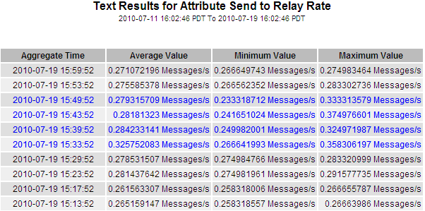
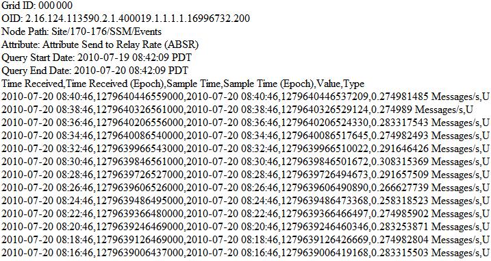

= 使用文字報告
:allow-uri-read: 
:icons: font
:imagesdir: ../media/

[role="lead"]
文字報告顯示已由 NMS 服務處理的屬性資料值的文字表示。根據您報告的時間段，會產生兩種類型的報告：針對少於一周的時間段的原始文本報告，以及針對超過一周的時間段的匯總文本報告。

== 原始文字報告

原始文字報告顯示有關所選屬性的詳細資訊：

* 接收時間：NMS 服務處理屬性資料樣本值的本地日期和時間。
* 採樣時間：在來源處採樣或更改屬性值的本地日期和時間。
* 值：採樣時的屬性值。

image::../media/raw_text_report.gif[顯示原始文字報告的螢幕截圖]

== 總結文字報告

與原始文字報告相比，匯總文字報告顯示更長時期（通常為一周）內的資料。每個條目都是 NMS 服務隨時間推移將多個屬性值（屬性值的集合）匯總為單一條目的結果，其中包含從聚合中得出的平均值、最大值和最小值。

每個條目顯示以下資訊：

* 聚合時間：NMS 服務聚合（收集）一組變更的屬性值的最後本機日期和時間。
* 平均值：聚合時間段內屬性值的平均值。
* 最小值：聚合時間段內的最小值。
* 最大值：聚合時間段內的最大值。

== 產生文字報告

文字報告顯示已由 NMS 服務處理的屬性資料值的文字表示。您可以報告資料中心站點、網格節點、元件或服務。

.開始之前
* 您必須使用link:../admin/web-browser-requirements.html["支援的網頁瀏覽器"]。
* 你有link:../admin/admin-group-permissions.html["特定存取權限"]。

.關於此任務
對於預計會不斷變化屬性數據，NMS 服務（在來源處）會定期對該屬性資料進行取樣。對於不經常變化的屬性資料（例如，基於狀態或狀況變化等事件的資料），當值發生變化時，會將屬性值傳送至 NMS 服務。

顯示的報告類型取決於配置的時間段。預設情況下，將產生超過一周的時間段的匯總文字報告。

灰色文字表示服務在採樣期間處於管理故障狀態。藍色文字表示服務處於未知狀態。

.步驟
. 選擇*支援* > *工具* > *網格拓撲*。
. 選擇 *_grid node_* > *_component 或 service_* > *Reports* > *Text*。
. 從*屬性*下拉清單中選擇要報告的屬性。
. 從*每頁結果數*下拉清單中選擇每頁的結果數。
. 若要將數值四捨五入至最多三位小數（例如，以百分比報告的屬性），請清除「*原始資料*」複選框。
. 從*快速查詢*下拉清單中選擇要報告的時間段。
+
選擇自訂查詢選項來選擇特定的時間範圍。

+
報告將在片刻後出現。留出幾分鐘的時間來統計長時間範圍的表格。

. 如果您選擇了自訂查詢，則需要透過輸入*開始日期*和*結束日期*來自訂要報告的時間段。
+
使用格式 `YYYY/MM/DDHH:MM:SS`當地時間。需要前導零來匹配格式。例如2017/4/6 7:30:00驗證失敗。正確的格式是：2017/04/06 07:30:00。

. 按一下“*更新*”。
+
片刻之後就會產生一份文字報告。留出幾分鐘的時間來統計長時間範圍的表格。根據查詢設定的時間長度，將顯示原始文字報表或總計文字報表。

== 匯出文字報告

匯出的文字報告會開啟一個新的瀏覽器選項卡，讓您可以選擇和複製資料。

.關於此任務
然後可以將複製的資料儲存到新文件（例如電子表格）中，並用於分析StorageGRID系統的效能。

.步驟
. 選擇*支援* > *工具* > *網格拓撲*。
. 建立文字報告。
. 點擊“匯出”image:../media/icon_export.gif["匯出圖示"] 。
+
image::../media/export_text_report.gif[螢幕截圖由周圍文字描述]

+
“匯出文字報告”視窗開啟並顯示報告。

+

. 選擇並複製匯出文字報告視窗的內容。
+
現在可以將這些資料貼到第三方文件（例如電子表格）中。

