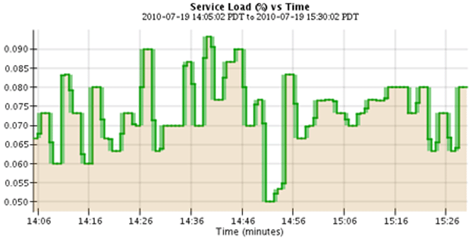

= 使用圖表和圖形
:allow-uri-read: 
:icons: font
:imagesdir: ../media/

[role="lead"]
您可以使用圖表和報告來監控StorageGRID系統的狀態並解決問題。

NOTE: 網格管理器會隨著每個版本的發布而更新，並且可能與本頁上的範例螢幕截圖不符。

== 圖表類型

圖表和圖形總結了特定StorageGRID指標和屬性的值。

網格管理器儀表板包括匯總網格和每個站點可用儲存的卡片。

image::../media/dashboard_data_and_metadata_space_usage_breakdown.png[儀表板資料和元資料空間使用情況明細]

租用戶管理器儀表板上的儲存使用情況面板顯示以下內容：

* 租戶的最大儲存桶（S3）或容器（Swift）的列表
* 表示最大桶子或容器相對大小的長條圖
* 已用空間總量，以及（如果設定了配額）剩餘空間量和百分比

image::../media/tenant_dashboard_with_buckets.png[租戶儀表板]

此外，可以從「節點」頁面和「*支援*」>「工具*」>「網格拓撲*」頁面取得顯示StorageGRID指標和屬性如何隨時間變化的圖表。

圖表有四種類型：

* *Grafana 圖表*：顯示在節點頁面上，Grafana 圖表用於繪製 Prometheus 指標隨時間變化的值。例如，儲存節點的 *NODES* > *Network* 標籤包含網路流量的 Grafana 圖表。
+
image::../media/nodes_page_network_tab.png[節點頁面網路選項卡]

+

NOTE: Grafana 圖表也包含在預先建立的儀表板中，可從 *SUPPORT* > *Tools* > *Metrics* 頁面取得。

* *折線圖*：可從「節點」頁面和「支援」>「工具」>「網格拓撲」頁面取得（選擇圖表圖標image:../media/icon_chart_new_for_11_5.png["圖標圖表（新）"]在資料值之後），折線圖用於繪製具有單位值（例如 NTP 頻率偏移，以 ppm 為單位）的StorageGRID屬性的值。值的變化隨時間以規則的資料間隔（箱）繪製。
+
image::../media/line_graph.gif[線圖]

* *區域圖*：可從「節點」頁面和「支援」>「工具」>「網格拓撲」頁面取得（選擇圖表圖標image:../media/icon_chart_new_for_11_5.png["圖標圖表（新）"]在資料值之後），面積圖用於繪製體積屬性數量，例如物件計數或服務負載值。面積圖與折線圖類似，但線下方有淺棕色陰影。值的變化隨時間以規則的資料間隔（箱）繪製。
+

* 有些圖表以不同類型的圖表圖示表示image:../media/icon_chart_new_for_11_5.png["圖表圖標"]並且具有不同的格式：
+
image::../media/charts_lost_object_detected.png[圖表偵測到丟失的物體]

* *狀態圖*：可從 *支援* > *工具* > *網格拓撲* 頁面取得（選擇圖表圖標image:../media/icon_chart_new_for_11_5.png["圖標圖表（新）"]在資料值之後，狀態圖用於繪製表示不同狀態的屬性值，例如服務狀態可以是線上、待機或離線。狀態圖與線圖類似，但轉換是不連續的；也就是說，值從一個狀態值跳到另一個狀態值。
+
image::../media/state_graph.gif[狀態圖]

.相關資訊
* link:viewing-nodes-page.html["查看節點頁面"]
* link:viewing-grid-topology-tree.html["查看網格拓撲樹"]
* link:reviewing-support-metrics.html["審查支持指標"]

== 圖表圖例

用於繪製圖表的線條和顏色具有特定的含義。

[cols="1a,3a"]
|===
| 例子 | 意義 

 a| 
image:../media/dark_green_chart_line.gif["螢幕截圖顯示深綠色線條"]
 a| 
報告的屬性值使用深綠色線條繪製。

 a| 
image:../media/light_green_chart_line.gif["螢幕截圖顯示了表示資料分箱的陰影"]
 a| 
深綠色線條周圍的淺綠色陰影表示該時間範圍內的實際值有所不同，並且已被「分箱」以便更快地繪圖。深色線代表加權平均值。淺綠色範圍表示箱內的最大值和最小值。面積圖使用淺棕色陰影來表示體積資料。

 a| 
image:../media/no_data_plotted_chart.gif["螢幕截圖顯示情節線上的空白區域"]
 a| 
空白區域（沒有繪製資料）表示屬性值不可用。背景可以是藍色、灰色或灰色和藍色的混合色，這取決於報告屬性的服務的狀態。

 a| 
image:../media/light_blue_chart_shading.gif["螢幕截圖中淡藍色陰影表示不確定的值"]
 a| 
淺藍色陰影表示當時部分或全部屬性值不確定；由於服務處於未知狀態，因此屬性未報告值。

 a| 
image:../media/gray_chart_shading.gif["螢幕截圖顯示由於未知值而產生的灰色陰影"]
 a| 
灰色陰影表示當時部分或全部屬性值未知，因為報告屬性的服務在管理上已關閉。

 a| 
image:../media/gray_blue_chart_shading.gif["螢幕截圖顯示了不確定值和未知值的混合"]
 a| 
灰色和藍色陰影的混合表示當時某些屬性值不確定（因為服務處於未知狀態），而其他屬性值未知，因為報告屬性的服務在管理上已關閉。

|===

== 顯示圖表和圖形

節點頁麵包含您應該定期存取的圖表和圖形，以監控儲存容量和吞吐量等屬性。在某些情況下，尤其是與技術支援合作時，您可以使用*支援* > *工具* > *網格拓撲*頁面來存取其他圖表。

.開始之前
您必須使用link:../admin/web-browser-requirements.html["支援的網頁瀏覽器"]。

.步驟
. 選擇*NODES*。然後，選擇一個節點、一個網站或整個網格。
. 選擇您想要查看資訊的選項卡。
+
一些選項卡包含一個或多個 Grafana 圖表，用於繪製 Prometheus 指標隨時間變化的值。例如，節點的 *NODES* > *Hardware* 標籤包含兩個 Grafana 圖表。

+
image::../media/nodes_page_hardware_tab_graphs.png[節點頁面硬體選項卡圖表]

. 或者，將遊標放在圖表上以查看特定時間點的更詳細值。
+
image::../media/nodes_page_memory_usage_details.png[節點頁面記憶體使用情況詳情]

. 根據需要，您通常可以顯示特定屬性或指標的圖表。從「節點」頁面上的表格中，選擇圖表圖標image:../media/icon_chart_new_for_11_5.png["圖表圖標"]位於屬性名稱的右側。
+

NOTE: 並非所有指標和屬性都提供圖表。

+
*範例 1*：從儲存節點的物件標籤中，您可以選擇圖表圖標image:../media/icon_chart_new_for_11_5.png["圖表圖標"]查看儲存節點成功的元資料儲存查詢總數。

+
image::../media/nodes_page_objects_successful_metadata_queries.png[成功的元資料查詢]

+
image::../media/nodes_page-objects_chart_successful_metadata_queries.png[圖表成功的元資料查詢]

+
*範例 2*：從儲存節點的物件標籤中，您可以選擇圖表圖標image:../media/icon_chart_new_for_11_5.png["圖表圖標"]查看 Grafana 隨時間偵測到的遺失物件的數量圖表。

+
image::../media/object_count_table.png[物件計數表]

+
image::../media/charts_lost_object_detected.png[圖表偵測到丟失的物體]

. 若要顯示節點頁面上未顯示的屬性的圖表，請選擇 *支援* > *工具* > *網格拓撲*。
. 選擇 *_grid node_* > *_component 或 service_* > *Overview* > *Main*。
+
image::../media/nms_chart.gif[螢幕截圖由周圍文字描述]

. 選擇圖表圖標image:../media/icon_chart_new_for_11_5.png["圖表圖標"]屬性旁邊。
+
顯示自動變成*報告* > *圖表*頁面。此圖表顯示過去一天的屬性資料。

== 產生圖表

圖表以圖形方式顯示屬性資料值。您可以報告資料中心站點、網格節點、元件或服務。

.開始之前
* 您必須使用link:../admin/web-browser-requirements.html["支援的網頁瀏覽器"]。
* 你有link:../admin/admin-group-permissions.html["特定存取權限"]。

.步驟
. 選擇*支援* > *工具* > *網格拓撲*。
. 選擇 *_grid node_* > *_component or service_* > *Reports* > *Charts*。
. 從*屬性*下拉清單中選擇要報告的屬性。
. 若要強制 Y 軸從零開始，請清除 *垂直縮放* 複選框。
. 若要以全精度顯示值，請選取「*原始資料*」複選框，或若要將數值四捨五入至最多三位小數（例如，以百分比報告的屬性），請清除「*原始資料*」複選框。
. 從*快速查詢*下拉清單中選擇要報告的時間段。
+
選擇自訂查詢選項來選擇特定的時間範圍。

+
片刻之後圖表就會出現。留出幾分鐘的時間來統計長時間範圍的表格。

. 如果您選擇了自訂查詢，請透過輸入*開始日期*和*結束日期*來自訂圖表的時間段。
+
使用格式 `_YYYY/MM/DDHH:MM:SS_`當地時間。需要前導零來匹配格式。例如2017/4/6 7:30:00驗證失敗。正確的格式是：2017/04/06 07:30:00。

. 選擇*更新*。
+
幾秒鐘後就會產生圖表。留出幾分鐘的時間來統計長時間範圍的表格。根據查詢設定的時間長度，將顯示原始文字報表或總計文字報表。

