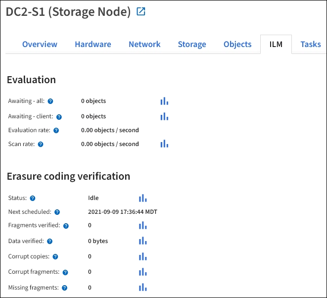

= 查看 ILM 選項卡
:allow-uri-read: 
:icons: font
:imagesdir: ../media/

[role="lead"]
ILM 標籤提供有關資訊生命週期管理 (ILM) 操作的資訊。

每個儲存節點、每個站點和整個網格都會顯示 ILM 標籤。對於每個站點和網格，ILM 標籤顯示 ILM 佇列隨時間變化的圖表。對於網格，此標籤還提供完成所有物件的完整 ILM 掃描的預計時間。

對於儲存節點，ILM 標籤提供有關擦除編碼物件的 ILM 評估和背景驗證的詳細資訊。

.相關資訊
* link:monitoring-information-lifecycle-management.html["監控資訊生命週期管理"]
* link:../admin/index.html["管理StorageGRID"]

