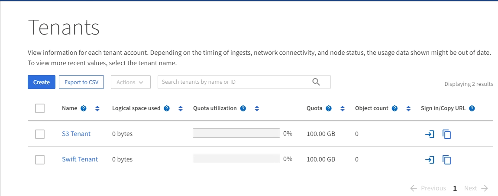

= 探索網格管理器
:allow-uri-read: 
:icons: font
:imagesdir: ../media/

[role="lead"]
網格管理器是基於瀏覽器的圖形介面，可讓您設定、管理和監控您的StorageGRID系統。

NOTE: 網格管理器會隨著每個版本的發布而更新，並且可能與本頁上的範例螢幕截圖不符。

當您登入網格管理器時，您正在連線到管理節點。每個StorageGRID系統包含一個主管理節點和任意數量的非主管理節點。您可以連接到任何管理節點，每個管理節點都會顯示StorageGRID系統的類似視圖。

您可以使用link:../admin/web-browser-requirements.html["支援的網頁瀏覽器"]。

== 網格管理器儀表板

首次登入網格管理器時，您可以使用儀表板link:../monitor/viewing-dashboard.html["監控系統活動"]一目了然。

儀表板包含有關係統健康和效能、儲存使用情況、ILM 進程、S3 操作和網格中的節點的資訊。你可以link:../monitor/viewing-dashboard.html["配置儀表板"]透過從包含有效監控系統所需資訊的卡片集合中進行選擇。

image::../media/grid_manager_dashboard_and_menu.png[網格管理器中的儀表板]

如需了解每張卡片上顯示的資訊的說明，請選擇協助圖標image:../media/icon_nms_question.png["問號圖示"]對於那張卡。

== 搜尋字段

標題列中的*搜尋*欄位可讓您快速導覽至網格管理員中的特定頁面。例如，您可以輸入 *km* 來存取金鑰管理伺服器 (KMS) 頁面。

您可以使用*搜尋*在網格管理員的側邊欄以及配置、維護和支援選單中尋找條目。您也可以按名稱搜尋網格節點和租戶帳戶等項目。

== 幫助菜單

幫助菜單image:../media/icon-help-menu-bar.png["選單列上的幫助圖標"]提供以下存取權限：

* 這link:../fabricpool/use-fabricpool-setup-wizard.html["FabricPool"]和link:../admin/use-s3-setup-wizard.html["S3 設定"]巫師
* 目前版本的StorageGRID文件中心
* link:../admin/using-grid-management-api.html["API 文件"]
* 有關目前安裝的StorageGRID版本的信息

== 警報選單

警報選單提供了一個易於使用的介面，用於檢測、評估和解決StorageGRID操作期間可能出現的問題。

從警報選單中，您可以執行以下操作link:../monitor/managing-alerts.html["管理警報"]：

* 查看當前警報
* 查看已解決的警報
* 配置靜默以抑制警報通知
* 定義觸發警報的條件的警報規則
* 配置電子郵件伺服器以接收警報通知

== 節點頁面

這link:../monitor/viewing-nodes-page.html["節點頁面"]顯示有​​關整個網格、網格中每個站點以及站點上每個節點的資訊。

節點主頁顯示整個網格的綜合指標。若要查看特定站點或節點的信息，請選擇該站點或節點。

image::../media/nodes_page.png[節點頁面主頁]

== 租戶頁面

這link:../admin/managing-tenants.html["租戶頁面"]允許您link:../tenant/index.html["建立並監控儲存租用戶帳戶"]適用於您的StorageGRID系統。您必須建立至少一個租用戶帳戶來指定誰可以儲存和檢索物件以及他們可以使用哪些功能。

租戶頁面還提供每個租戶的使用詳情，包括使用的儲存量和物件數量。如果您在建立租用戶時設定了配額，您可以看到已使用了多少配額。

== ILM 選單

這link:using-information-lifecycle-management.html["ILM 選單"]允許您link:../ilm/index.html["配置資訊生命週期管理 (ILM) 規則和策略"]控制資料持久性和可用性。您也可以輸入物件標識符來查看該物件的元資料。

您可以從 ILM 選單查看和管理 ILM：

* 規則
* 政策
* 策略標籤
* 儲存池
* 儲存等級
* 區域
* 對像元資料查找

== 配置選單

設定選單可讓您指定網路設定、安全設定、系統設定、監控選項和存取控制選項。

=== 網路任務

網路任務包括：

* link:../admin/managing-high-availability-groups.html["管理高可用性組"]
* link:../admin/managing-load-balancing.html["管理負載平衡器端點"]
* link:../admin/configuring-s3-api-endpoint-domain-names.html["配置 S3 端點域名"]
* link:../admin/managing-traffic-classification-policies.html["管理流量分類策略"]
* link:../admin/configure-vlan-interfaces.html["配置 VLAN 介面"]

=== 安全任務

安全任務包括：

* link:../admin/using-storagegrid-security-certificates.html["管理安全證書"]
* link:../admin/manage-firewall-controls.html["管理內部防火牆控制"]
* link:../admin/kms-configuring.html["配置金鑰管理伺服器"]
* 配置安全設置，包括link:../admin/manage-tls-ssh-policy.html["TLS 和 SSH 策略"]，link:../admin/changing-network-options-object-encryption.html["網路和物件安全選項"] ， 和link:../admin/changing-browser-session-timeout-interface.html["介面安全設定"]。
* 配置link:../admin/configuring-storage-proxy-settings.html["儲存代理"]或link:../admin/configuring-admin-proxy-settings.html["管理代理"]

=== 系統任務

系統任務包括：

* 使用link:../admin/grid-federation-overview.html["網格聯盟"]複製租用戶帳戶資訊並在兩個StorageGRID系統之間複製物件資料。
* 可選地，啟用link:../admin/configuring-stored-object-compression.html["壓縮儲存的對象"]選項。
* link:../ilm/managing-objects-with-s3-object-lock.html["管理 S3 對象鎖"]
* 了解儲存選項，例如link:../admin/what-object-segmentation-is.html["物件分割"]和link:../admin/what-storage-volume-watermarks-are.html["儲存卷浮"]。
* link:../ilm/manage-erasure-coding-profiles.html["管理擦除編碼配置文件"] 。

=== 監控任務

監控任務包括：

* link:../monitor/configure-audit-messages.html["配置審計訊息和日誌目標"]
* link:../monitor/using-snmp-monitoring.html["使用 SNMP 監控"]

=== 存取控制任務

存取控制任務包括：

* link:../admin/managing-admin-groups.html["管理管理員群組"]
* link:../admin/managing-users.html["管理管理員用戶"]
* 改變link:../admin/changing-provisioning-passphrase.html["設定密碼"]或者link:../admin/change-node-console-password.html["節點控制台密碼"]
* link:../admin/using-identity-federation.html["使用身分聯合"]
* link:../admin/configuring-sso.html["設定 SSO"]

== 維護選單

維護選單可讓您執行維護任務、系統維護和網路維護。

=== 任務

維護任務包括：

* link:../maintain/decommission-procedure.html["退役作業"]刪除未使用的網格節點和站點
* link:../expand/index.html["擴張行動"]新增新的網格節點和站點
* link:../maintain/warnings-and-considerations-for-grid-node-recovery.html["網格節點復原程序"]更換故障節點並恢復數據
* link:../maintain/rename-grid-site-node-overview.html["重新命名過程"]變更網格、站點和節點的顯示名稱
* link:../troubleshoot/verifying-object-integrity.html["物件存在性檢查操作"]驗證物件資料的存在（儘管不是正確性）
* 執行link:../maintain/rolling-reboot-procedure.html["滾動重啟"]重新啟動多個網格節點
* link:../maintain/restoring-volume.html["磁碟區恢復操作"]

=== 系統

您可以執行的系統維護任務包括：

* link:../admin/viewing-storagegrid-license-information.html["查看StorageGRID許可證信息"]或者link:../admin/updating-storagegrid-license-information.html["更新許可證信息"]
* 產生並下載link:../maintain/downloading-recovery-package.html["恢復包"]
* 執行StorageGRID軟體更新，包括軟體升級、修補程式以及選定裝置上的SANtricity OS 軟體更新
+
** link:../upgrade/index.html["升級過程"]
** link:../maintain/storagegrid-hotfix-procedure.html["修補程式"]
** https://docs.netapp.com/us-en/storagegrid-appliances/sg6000/upgrading-santricity-os-on-storage-controllers-using-grid-manager-sg6000.html["使用網格管理器升級 SG6000 儲存控制器上的SANtricity作業系統"^]
** https://docs.netapp.com/us-en/storagegrid-appliances/sg5700/upgrading-santricity-os-on-storage-controllers-using-grid-manager-sg5700.html["使用網格管理器升級 SG5700 儲存控制器上的SANtricity作業系統"^]

=== 網路

您可以執行的網路維護任務包括：

* link:../maintain/configuring-dns-servers.html["配置 DNS 伺服器"]
* link:../maintain/updating-subnets-for-grid-network.html["更新網格網路子網"]
* link:../maintain/configuring-ntp-servers.html["管理 NTP 伺服器"]

== 支援選單

支援選單提供的選項可協助技術支援分析和排除系統故障。

=== 工具

從支援選單的工具部分，您可以：

* link:../admin/configure-autosupport-grid-manager.html["配置AutoSupport"]
* link:../monitor/running-diagnostics.html["運行診斷"]電網現狀
* link:../monitor/viewing-grid-topology-tree.html["存取網格拓撲樹"]查看有關網格節點、服務和屬性的詳細信息
* link:../monitor/collecting-log-files-and-system-data.html["收集日誌檔案和系統數據"]
* link:../monitor/reviewing-support-metrics.html["審查支持指標"]
+

NOTE: *Metrics* 選項提供的工具旨在供技術支援使用。這些工具中的某些功能和選單項目故意不起作用。

=== 警報（遺留）

有關舊警報的資訊已從此版本的文件中刪除。參考 https://docs.netapp.com/us-en/storagegrid-118/monitor/managing-alerts-and-alarms.html["管理警報和警報（StorageGRID 11.8 文件）"^]。

=== 其他

從「支援」選單的「其他」部分，您可以：

* 管理link:../admin/manage-link-costs.html["鏈路成本"]
* 看法link:../admin/viewing-notification-status-and-queues.html["網路管理系統（NMS）"]條目
* 管理link:../admin/what-storage-volume-watermarks-are.html["儲存浮水印"]

