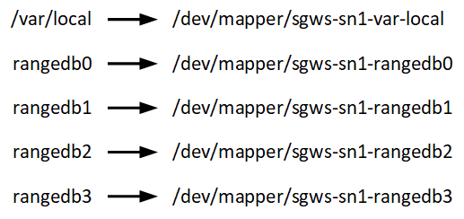

= 節點容器遷移要求
:allow-uri-read: 
:icons: font
:imagesdir: ../media/

[role="lead"]
節點遷移功能可讓您手動將節點從一個主機移動到另一個主機。通常，兩個主機位於同一個實體資料中心。

節點遷移可讓您執行實體主機維護，而無需中斷網格操作。在使實體主機離線之前，將所有StorageGRID節點逐一移動到另一台主機。遷移節點只需要每個節點短暫停機，且不會影響網格服務的運作或可用性。

如果您想要使用StorageGRID節點遷移功能，您的部署必須符合其他需求：

* 單一實體資料中心內跨主機的網路介面名稱一致
* StorageGRID元資料和物件儲存庫磁碟區的共用存儲，可供單一實體資料中心內的所有主機存取。例如，您可能使用NetApp E 系列儲存陣列。

如果您正在使用虛擬主機且底層虛擬機器管理程式層支援虛擬機器遷移，則您可能想要使用此功能而不是StorageGRID中的節點遷移功能。在這種情況下，您可以忽略這些額外的要求。

在執行遷移或虛擬機器管理程式維護之前，請正常關閉節點。請參閱說明link:../maintain/shutting-down-grid-node.html["關閉網格節點"]。

== 不支援 VMware Live Migration

在 VMware VM 上執行裸機安裝時，OpenStack Live Migration 和 VMware live vMotion 會導致虛擬機器時鐘時間跳躍，並且不支援任何類型的網格節點。雖然很少見，但不正確的時鐘時間可能會導致資料遺失或配置更新。

支援冷遷移。在冷遷移中，您需要在主機之間遷移StorageGRID節點之前關閉它們。請參閱說明link:../maintain/shutting-down-grid-node.html["關閉網格節點"]。

== 一致的網路介面名稱

若要將節點從一個主機移至另一台主機， StorageGRID主機服務需要確信該節點在目前位置的外部網路連線可以在新位置複製。它透過在主機中使用一致的網路介面名稱來獲得這種信心。

例如，假設在 Host1 上執行的StorageGRID NodeA 已配置下列介面映射：

image::../media/eth0_bond.gif[該圖像由周圍的文字解釋。]

箭頭的左側對應於從StorageGRID容器內部檢視的傳統介面（即分別為 Grid、Admin 和 Client Network 介面）。箭頭的右側對應於提供這些網路的實際主機接口，它們是從屬於同一實體介面綁定的三個 VLAN 介面。

現在，假設您想將 NodeA 遷移到 Host2。如果 Host2 也有名為 bond0.1001、bond0.1002 和 bond0.1003 的接口，系統將允許移動，假設同名接口在 Host2 上提供與 Host1 上相同的連接。如果 Host2 沒有同名接口，則不允許移動。

有很多方法可以實現跨多個主機的一致網路介面命名；請參閱link:configuring-host-network.html["配置主機網路"]舉一些例子。

== 共享儲存

為了實現快速、低開銷的節點遷移， StorageGRID節點遷移功能不會物理移動節點資料。相反，節點遷移作為一對匯出和導入操作來執行，如下所示：

. 在「節點匯出」作業期間，從 HostA 上執行的節點容器中提取少量持久狀態數據，並將其緩存在該節點的系統資料卷上。然後，HostA 上的節點容器被取消實例化。
. 在「節點導入」作業期間，將實例化 HostB 上使用與 HostA 上相同的網路介面和區塊儲存對應的節點容器。然後，將快取的持久性資料插入新實例中。

在這種操作模式下，節點的所有系統資料和物件儲存磁碟區都必須能夠從 HostA 和 HostB 訪問，才能允許遷移並使其正常運作。此外，它們必須使用保證引用 HostA 和 HostB 上相同 LUN 的名稱來對應到節點中。

以下範例顯示了StorageGRID儲存節點的區塊裝置對映的一個解決方案，其中主機上使用 DM 多路徑，並且已在 `/etc/multipath.conf`提供所有主機上可用的一致、友善的區塊設備名稱。

