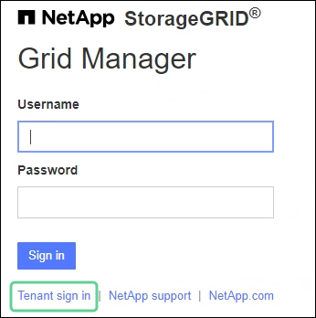

= Sign in租戶管理器
:allow-uri-read: 
:icons: font
:imagesdir: ../media/

[role="lead"]
您可以透過在網址列中輸入租用戶的 URL 來存取租用戶管理員link:../admin/web-browser-requirements.html["支援的網頁瀏覽器"]。

.開始之前
* 您有登入憑證。
* 您有一個用於存取租用戶管理員的 URL，由您的網格管理員提供。  URL 將類似於以下範例之一：
+
`\https://FQDN_or_Admin_Node_IP/`

+
`\https://FQDN_or_Admin_Node_IP:port/`

+
`\https://FQDN_or_Admin_Node_IP/?accountId=20-digit-account-id`

+
`\https://FQDN_or_Admin_Node_IP:port/?accountId=20-digit-account-id`

+
URL 始終包含完全限定網域名稱 (FQDN)、管理節點的 IP 位址或管理節點 HA 群組的虛擬 IP 位址。它可能還包括連接埠號碼、20 位租戶帳戶 ID 或兩者。

* 如果 URL 不包含租用戶的 20 位帳戶 ID，則您擁有此帳戶 ID。
* 您正在使用link:../admin/web-browser-requirements.html["支援的網頁瀏覽器"]。
* 您的網頁瀏覽器已啟用 Cookie。
* 您屬於一個使用者群組link:tenant-management-permissions.html["特定存取權限"]。

.步驟
. 啟動link:../admin/web-browser-requirements.html["支援的網頁瀏覽器"]。
. 在瀏覽器的網址列中輸入訪問租用戶管理員的URL。
. 如果出現安全性警報，請使用瀏覽器的安裝精靈安裝憑證。
. Sign in租戶管理器。
+
出現的登入畫面取決於您輸入的 URL 以及是否已為StorageGRID設定單一登入 (SSO)。

+
[role="tabbed-block"]
====
.不使用 SSO
--
如果StorageGRID未使用 SSO，則會出現下列其中一個畫面：

** 網格管理器登入頁面。選擇*租戶登入*連結。
+

** 租戶管理器登入頁面。*帳戶*欄位可能已填寫完畢，如下所示。
+
image::../media/tenant_user_sign_in.png[租戶經理登入頁面]

+
... 如果未顯示租用戶的 20 位元帳戶 ID，請選擇租用戶帳戶的名稱（如果它出現在最近帳戶清單中），或輸入帳戶 ID。
... 輸入您的使用者名稱和密碼。
... 選擇*Sign in*。
+
出現租戶管理器儀表板。

... 如果您從其他人收到了初始密碼，請選擇 *_username_* > *變更密碼* 來保護您的帳戶。

--
.使用 SSO
--
如果StorageGRID使用 SSO，則會出現下列其中一個畫面：

** 您組織的 SSO 頁面。例如：
+
image::../media/sso_organization_page.gif[SSO 的範例組織登入頁面]

+
輸入您的標準 SSO 憑證，然後選擇 *Sign in*。

** 租戶管理器 SSO 登入頁面。
+
image::../media/sign_in_sso.png[如果啟用了 SSO，則登入租用戶帳戶]

+
... 如果未顯示租用戶的 20 位元帳戶 ID，請選擇租用戶帳戶的名稱（如果它出現在最近帳戶清單中），或輸入帳戶 ID。
... 選擇*Sign in*。
... 使用您的標準 SSO 憑證在您組織的 SSO 登入頁面上Sign in。
+
出現租戶管理器儀表板。

--
====

