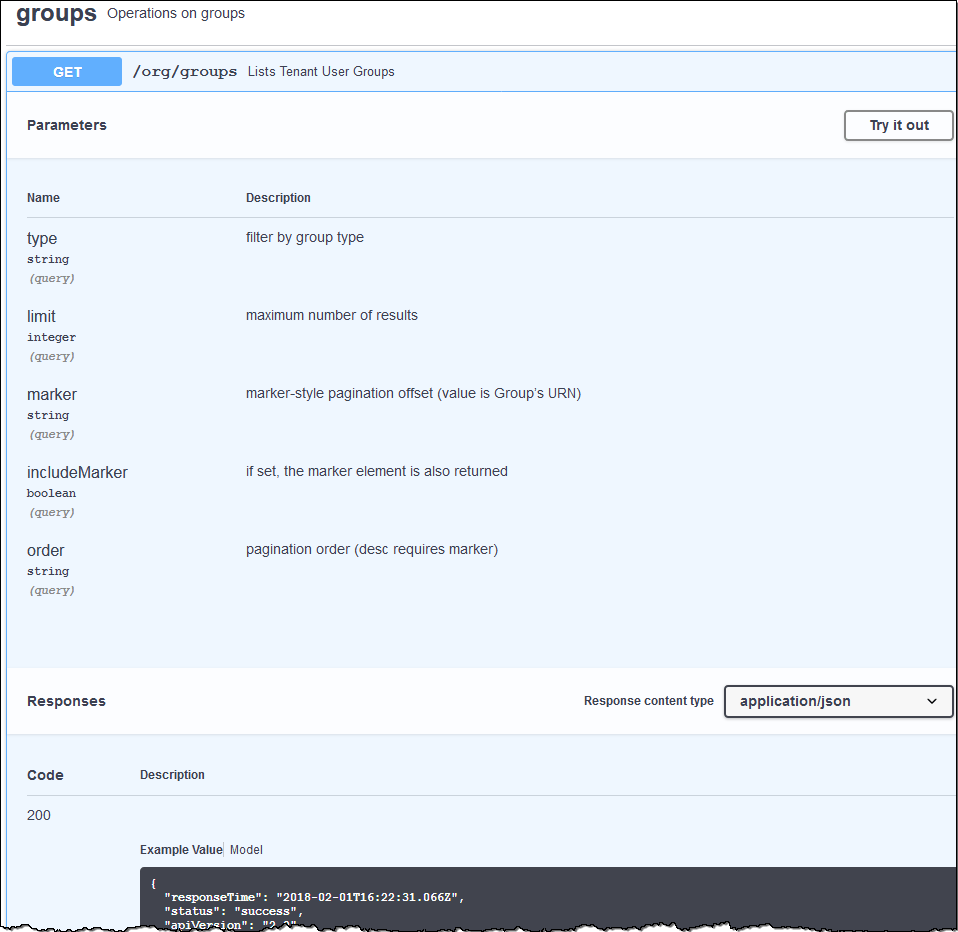

= 了解租戶管理 API
:allow-uri-read: 
:icons: font
:imagesdir: ../media/

[role="lead"]
您可以使用租用戶管理 REST API 而不是租用戶管理器使用者介面執行系統管理任務。例如，您可能希望使用 API 來自動化操作或更快地建立多個實體（例如使用者）。

租戶管理 API：

* 使用Swagger開源API平台。  Swagger 提供了直覺的使用者介面，允許開發人員和非開發人員與 API 進行互動。  Swagger 使用者介面為每個 API 操作提供了完整的詳細資訊和文件。
* 用途link:tenant-management-api-versioning.html["版本控制以支援無中斷升級"]。

若要存取租戶管理 API 的 Swagger 文件：

. Sign in租戶管理器。
. 從租戶管理員的頂部，選擇說明圖示並選擇*API 文件*。

== API 操作

租用戶管理 API 將可用的 API 作業組織到以下部分：

* *account*：目前租用戶帳戶的操作，包括取得儲存使用資訊。
* *auth*：執行使用者會話認證的操作。
+
租用戶管理 API 支援 Bearer Token 身分驗證方案。對於租用戶登入，您需要在身份驗證請求的 JSON 主體中提供使用者名稱、密碼和 accountId（即 `POST /api/v3/authorize`）。如果使用者驗證成功，則會傳回安全令牌。必須在後續 API 請求的標頭中提供此令牌（「授權：承載令牌」）。

+
有關提高身份驗證安全性的信息，請參閱link:protecting-against-cross-site-request-forgery-csrf.html["防止跨站請求偽造"]。

+

NOTE: 如果為StorageGRID系統啟用了單一登入 (SSO)，則必須執行不同的步驟進行驗證。查看link:../admin/using-grid-management-api.html["網格管理 API 使用說明"]。

* *config*：與產品發布和租戶管理API版本相關的操作。您可以列出產品發布版本以及該版本支援的 API 的主要版本。
* *容器*：對 S3 儲存桶或 Swift 容器的操作。
* *deactivated-features*：查看可能已停用的功能的操作。
* *端點*：管理端點的操作。端點允許 S3 儲存桶使用外部服務進行StorageGRID CloudMirror 複製、通知或搜尋整合。
* *grid-federation-connections*：網格聯合連接和跨網格複製的操作。
* *groups*：管理本機租用戶群組和從外部身分識別來源擷取共同租用戶群組的操作。
* *identity-source*：設定外部身分來源並手動同步聯合群組和使用者資訊的操作。
* *ilm*：資訊生命週期管理 (ILM) 設定的操作。
* *regions*：確定已為StorageGRID系統配置哪些區域的操作。
* *s3*：管理租用戶用戶的 S3 存取金鑰的操作。
* *s3-object-lock*：對全域 S3 物件鎖定設定的操作，用於支援法規遵循。
* *使用者*：檢視和管理租戶使用者的操作。

== 操作細節

展開每個 API 操作時，您可以看到其 HTTP 操作、端點 URL、任何必需或可選參數的清單、請求正文的範例（需要時）以及可能的回應。

== 發出 API 請求

CAUTION: 您使用 API 文件網頁執行的任何 API 操作都是即時操作。請注意不要錯誤地建立、更新或刪除配置資料或其他資料。

.步驟
. 選擇 HTTP 操作以查看請求詳細資訊。
. 確定請求是否需要其他參數，例如群組或使用者 ID。然後，取得這些值。您可能需要先發出不同的 API 請求來取得所需的資訊。
. 確定是否需要修改範例請求正文。如果是，您可以選擇*模型*來了解每個領域的要求。
. 選擇*試用*。
. 提供任何所需的參數，或根據需要修改請求正文。
. 選擇*執行*。
. 查看回應代碼以確定請求是否成功。

