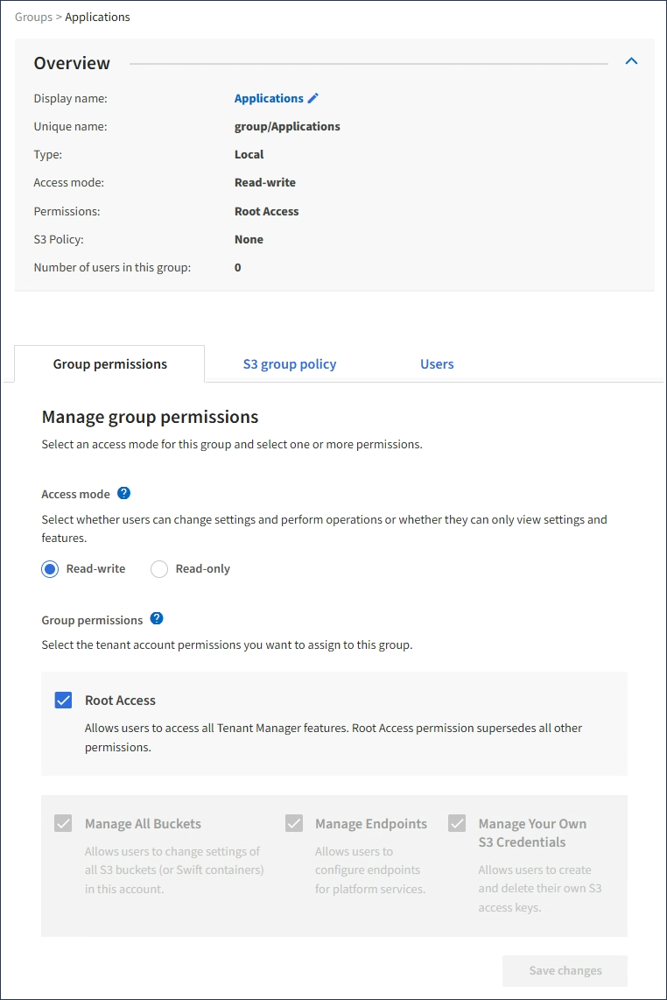

= 查看和編輯群組詳細信息
:allow-uri-read: 
:icons: font
:imagesdir: ../media/

[role="lead"]
查看群組的詳細資訊時，您可以變更該群組的顯示名稱、權限、策略以及屬於該群組的使用者。

.開始之前
* 您已使用link:../admin/web-browser-requirements.html["支援的網頁瀏覽器"]。
* 您屬於具有 Root 存取權限的使用者群組。

.步驟
. 選擇*存取管理* > *群組*。
. 選擇您要查看或編輯其詳細資料的群組的名稱。
+
或者，您可以選擇*操作* > *查看群組詳細資料*。

+
出現群組詳細資料頁面。以下範例顯示 S3 組詳細資訊頁面。

+

. 根據需要更改組設定。
+

TIP: 為確保您的變更已儲存，請在每個部分進行變更後選擇「*儲存變更*」。儲存變更後，頁面右上角會出現一條確認訊息。

+
.. 或者，選擇顯示名稱或編輯圖標image:../media/icon_edit_tm.png["編輯圖示"]更新顯示名稱。
+
您不能變更群組的唯一名稱。您無法編輯聯合群組的顯示名稱。

.. 或者，更新權限。
.. 對於群組策略，請對您的 S3 租戶進行適當的變更。
+
*** 如果您正在編輯 S3 租用戶的群組，則可以選擇不同的 S3 群組原則。如果您選擇自訂 S3 策略，請根據需要更新 JSON 字串。
*** 如果您正在編輯 Swift 租用戶的群組，可以選擇或清除 *Swift 管理員* 複選框。
+
有關 Swift 管理員權限的更多信息，請參閱為 Swift 租用戶建立群組的說明。

.. （可選）新增或刪除使用者。

. 確認您已為變更的每個部分選擇了「儲存變更」。

.相關資訊
* link:creating-groups-for-s3-tenant.html["為 S3 租用戶建立群組"]
* link:creating-groups-for-swift-tenant.html["為 Swift 租用戶建立群組"]

