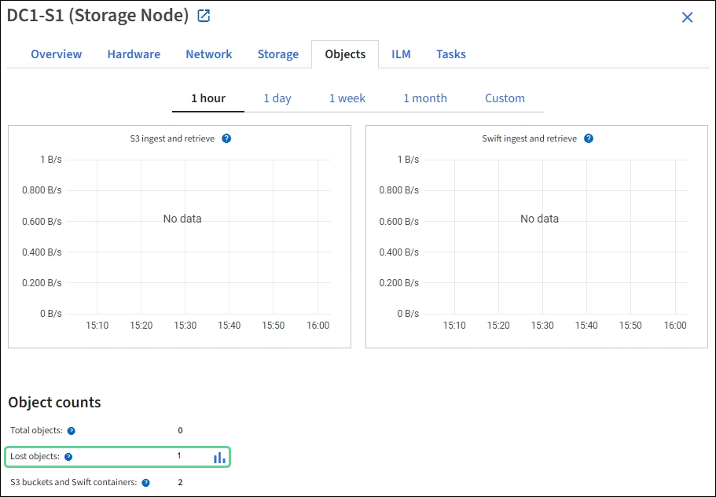

= 調查遺失的物品
:allow-uri-read: 
:icons: font
:imagesdir: ../media/

[role="lead"]
當觸發「物體遺失」警報時，您必須立即進行調查。收集受影響對象的資訊並聯絡技術支援。

.開始之前
* 您必須使用link:../admin/web-browser-requirements.html["支援的網頁瀏覽器"]。
* 你有link:../admin/admin-group-permissions.html["特定存取權限"]。
* 你必須擁有 `Passwords.txt`文件。

.關於此任務
*物件遺失*警報表示StorageGRID認為網格中沒有物件的副本。資料可能已永久遺失。

立即調查遺失物品警報。您可能需要採取措施來防止進一步的資料遺失。在某些情況下，如果您及時採取行動，也許能夠恢復遺失的物品。

.步驟
. 選擇*NODES*。
. 選擇*_Storage Node_* > *Objects*。
. 查看物件計數表中顯示的遺失物件的數量。
+
此數字表示該網格節點偵測到的整個StorageGRID系統中缺少的物件總數。該值是 LDR 和 DDS 服務中的資料儲存組件的遺失物件計數器的總和。

+

. 從管理節點，link:../audit/accessing-audit-log-file.html["訪問審計日誌"]確定觸發*物件遺失*警報的物件的唯一識別碼（UUID）：
+
.. 登入網格節點：
+
... 輸入以下命令： `ssh admin@grid_node_IP`
... 輸入 `Passwords.txt`文件。
... 輸入以下命令切換到root： `su -`
... 輸入 `Passwords.txt`文件。當您以 root 身分登入時，提示字元將從 `$`到 `#`。

.. 更改為審計日誌所在的目錄。
+
--
審計日誌目錄和適用節點取決於您的審計目標設定。

[cols="1a,2a"]
|===
| 選項 | 目的地 

 a| 
本地節點（預設）
 a| 
`/var/local/log/localaudit.log`

 a| 
管理節點/本地節點
 a| 
*** 管理節點（主節點和非主節點）： `/var/local/audit/export/audit.log`
*** 所有節點： `/var/local/log/localaudit.log`在此模式下，文件通常為空或缺失。

 a| 
外部系統日誌伺服器
 a| 
`/var/local/log/localaudit.log`

|===
根據您的審計目標設置，輸入： `cd /var/local/log`或者 `/var/local/audit/export/`

要了解更多信息，請參閱link:../monitor/configure-audit-messages.html#select-audit-information-destinations["選擇審計資訊目的地"]。

--
.. 使用 grep 提取物件遺失 (OLST) 審計訊息。進入： `grep OLST audit_file_name`
.. 請注意訊息中包含的 UUID 值。
+
[listing]
----
Admin: # grep OLST audit.log
2020-02-12T19:18:54.780426 [AUDT:[CBID(UI64):0x38186FE53E3C49A5][UUID(CSTR):"926026C4-00A4-449B-AC72-BCCA72DD1311"]
[PATH(CSTR):"source/cats"][NOID(UI32):12288733][VOLI(UI64):3222345986][RSLT(FC32):NONE][AVER(UI32):10]
[ATIM(UI64):1581535134780426][ATYP(FC32):OLST][ANID(UI32):12448208][AMID(FC32):ILMX][ATID(UI64):7729403978647354233]]
----

. 使用 UUID 尋找遺失物件的元資料：
+
.. 選擇 *ILM* > *物件元資料查找*。
.. 輸入 UUID，然後選擇*尋找*。
.. 查看元資料中的位置，並採取適當的措施：
+
[cols="2a,4a"]
|===
| 元數據 | 結論 

 a| 
未找到物件 <object_identifier>
 a| 
如果未找到該對象，則傳回訊息「ERROR」：「」。

如果未找到該對象，您可以重設*遺失的對象*的數量以清除警報。缺少某個物件表示該物件被故意刪除。

 a| 
位置 > 0
 a| 
如果輸出中列出了位置，則「*物件遺失*」警報可能是誤報。

確認對象存在。使用輸出中列出的節點 ID 和檔案路徑來確認目標檔案位於列出的位置。

(程式link:searching-for-and-restoring-potentially-lost-objects.html["尋找可能遺失的物品"]解釋如何使用節點 ID 來尋找正確的儲存節點。

如果物件存在，您可以重置*遺失的物件*的數量以清除警報。

 a| 
位置 = 0
 a| 
如果輸出中沒有列出位置，則該物件可能會遺失。您可以嘗試link:searching-for-and-restoring-potentially-lost-objects.html["搜尋並恢復對象"]您也可以自行解決，或聯絡技術支援。

技術支援可能會要求您確定是否正在進行儲存復原程序。查看有關link:../maintain/restoring-volume.html["使用網格管理器恢復物件數據"]和link:../maintain/restoring-object-data-to-storage-volume.html["將物件資料還原到儲存卷"]。

|===

