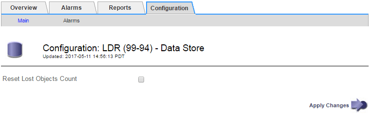

= 重置遺失和缺失的物體數量
:allow-uri-read: 
:icons: font
:imagesdir: ../media/

[role="lead"]
在調查StorageGRID系統並確認所有記錄的遺失物件都永久遺失或只是誤報後，您可以將「遺失物件」屬性的值重設為零。

.開始之前
* 您必須使用link:../admin/web-browser-requirements.html["支援的網頁瀏覽器"]。
* 你有link:../admin/admin-group-permissions.html["特定存取權限"]。

.關於此任務
您可以從以下任一頁面重設遺失物品計數器：

* *支援* > *工具* > *網格拓撲* > *_站點_* > *_儲存節點_* > *LDR* > *資料儲存* > *概述* > *主要*
* *支援* > *工具* > *網格拓撲* > *_站點_* > *_儲存節點_* > *DDS* > *資料儲存* > *概述* > *主要*

這些說明顯示從 *LDR* > *Data Store* 頁面重設計數器。

.步驟
. 選擇*支援* > *工具* > *網格拓撲*。
. 對於具有 *Objects lost* 警報或 LOST 警報的儲存節點，選擇 *_Site_* > *_Storage Node_* > *LDR* > *Data Store* > *Configuration*。
. 選擇*重置遺失物品數量*。
+

. 按一下“應用變更”。
+
遺失物件屬性重設為 0，並且*物件遺失*警報和遺失警報清除，這可能需要幾分鐘。

. 或者，重置在識別遺失物件的過程中可能已增加的其他相關屬性值。
+
.. 選擇 *_Site_* > *_Storage Node_* > *LDR* > *Erasure Coding* > *Configuration*。
.. 選擇*重置讀取失敗計數*和*重置偵測到的損壞副本計數*。
.. 按一下“應用變更”。
.. 選擇 *_Site_* > *_Storage Node_* > *LDR* > *Verification* > *Configuration*。
.. 選擇*重置遺失物件數*和*重置損壞物件數*。
.. 如果您確信不需要隔離的對象，您可以選擇*刪除隔離的對象*。
+
當後台驗證發現損壞的複製物件副本時，就會建立隔離物件。在大多數情況下， StorageGRID會自動取代損壞的對象，並且可以安全地刪除隔離的對象。但是，如果觸發了「*物件遺失*」警報或「遺失」警報，技術支援人員可能想要存取被隔離的物件。

.. 按一下“應用變更”。

+
單擊“應用更改”後，可能需要一些時間才能重置屬性。

