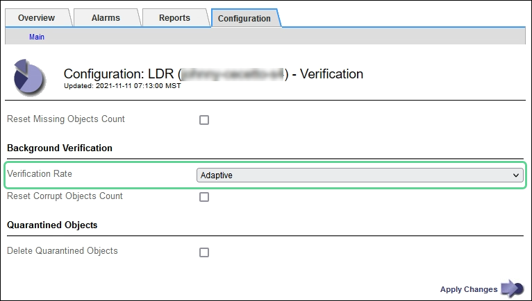

= 驗證物件完整性
:allow-uri-read: 
:icons: font
:imagesdir: ../media/

[role="lead"]
StorageGRID系統驗證儲存節點上物件資料的完整性，檢查損壞和遺失的物件。

驗證過程分為兩個部分：後台驗證和物件存在性檢查（以前稱為前台驗證）。他們共同努力以確保數據的完整性。後台驗證自動執行，持續檢查物件資料的正確性。使用者可以觸發物件存在性檢查，以更快地驗證物件的存在性（但不是正確性）。

== 什麼是背景驗證？

後台驗證程序會自動且持續地檢查儲存節點是否存在物件資料的損壞副本，並自動嘗試修復發現的任何問題。

後台驗證檢查複製物件和擦除編碼物件的完整性，如下所示：

* *複製物件*：如果後台驗證程序發現複製物件已損壞，則損壞的副本將從其位置刪除並隔離到儲存節點的其他位置。然後，產生並放置一個新的未損壞的副本以滿足活動的 ILM 策略。新副本可能不會放置在用於原始副本的儲存節點上。

NOTE: 損壞的物件資料被隔離而不是從系統中刪除，因此仍然可以存取。有關存取隔離對象資料的更多信息，請聯繫技術支援。

* *擦除編碼物件*：如果後台驗證程序偵測到擦除編碼物件的片段已損壞， StorageGRID會自動嘗試使用剩餘的資料和奇偶校驗片段在同一儲存節點上重建遺失的片段。如果無法重建損壞的片段，則會嘗試擷取該物件的另一個副本。如果檢索成功，則執行 ILM 評估以建立擦除編碼物件的替換副本。
+
後台驗證程序僅檢查儲存節點上的物件。它不會檢查雲端儲存池中的物件。物體必須存在超過四天才有資格進行背景驗證。

後台驗證以連續的速率運行，不會幹擾正常的系統活動。背景驗證無法停止。但是，如果您懷疑有問題，可以增加後台驗證率以更快地驗證儲存節點的內容。

=== 與背景驗證相關的警報

如果系統偵測到無法自動修正的損壞物件（因為損壞導致無法辨識物件），則會觸發*偵測到未辨識的損壞物件*警報。

如果後台驗證無法取代損壞的對象，因為它無法找到另一個副本，則會觸發*對象遺失*警報。

=== 更改背景驗證率

如果您擔心資料完整性，可以變更後台驗證檢查儲存節點上複製物件資料的速率。

.開始之前
* 您必須使用link:../admin/web-browser-requirements.html["支援的網頁瀏覽器"]。
* 你有link:../admin/admin-group-permissions.html["特定存取權限"]。

.關於此任務
您可以更改儲存節點上的後台驗證的驗證率：

* 自適應：預設設定。此任務設計為以最大 4 MB/s 或 10 個物件/s（以先超過者為準）的速度進行驗證。
* 高：儲存驗證進行得很快，但其速度可能會減慢普通系統活動的速度。

僅當您懷疑硬體或軟體故障可能損壞物件資料時才使用高驗證率。高優先級後台驗證完成後，驗證率會自動重設為自適應。

.步驟
. 選擇*支援* > *工具* > *網格拓撲*。
. 選擇 *_Storage Node_* > *LDR* > *Verification*。
. 選擇*配置* > *主要*。
. 前往 *LDR* > *驗證* > *配置* > *主要*。
. 在背景驗證下，選擇*驗證率* > *高*或*驗證率* > *自適應*。
+

. 按一下“應用變更”。
. 監控複製物件的後台驗證結果。
+
.. 前往 *NODES* > *_Storage Node_* > *Objects*。
.. 在驗證部分，監視*損壞的物件*和*未識別的損壞的物件*的值。
+
如果後台驗證發現損壞的複製物件數據，則「損壞的物件」指標將遞增，並且StorageGRID將嘗試從資料中提取物件標識符，如下所示：

+
*** 如果可以提取物件標識符， StorageGRID會自動建立物件資料的新副本。可以在滿足活動 ILM 策略的StorageGRID系統中的任何地方建立新副本。
*** 如果無法擷取物件識別碼（因為已損壞），則「*未識別的損壞物件*」指標將遞增，並觸發「偵測到未識別的損壞物件*」警報。

.. 如果發現損壞的複製對象數據，請聯絡技術支援以確定損壞的根本原因。

. 監控擦除編碼物件的背景驗證結果。
+
如果後台驗證發現擦除編碼物件資料的損壞片段，則「偵測到損壞片段」屬性將會遞增。  StorageGRID透過在相同儲存節點上重建損壞的片段來進行復原。

+
.. 選擇*支援* > *工具* > *網格拓撲*。
.. 選擇 *_Storage Node_* > *LDR* > *Erasure Coding*。
.. 在驗證結果表中，監控偵測到的損壞片段 (ECCD) 屬性。

. 在StorageGRID系統自動恢復損壞的物件後，重置損壞物件的數量。
+
.. 選擇*支援* > *工具* > *網格拓撲*。
.. 選擇 *_Storage Node_* > *LDR* > *Verification* > *Configuration*。
.. 選擇*重置損壞物件數*。
.. 按一下“應用變更”。

. 如果您確信隔離的物件不再需要，則可以將其刪除。
+

NOTE: 如果觸發了「*物件遺失*」警報，技術支援人員可能想要存取隔離的物件以協助偵錯潛在問題或嘗試復原資料。

+
.. 選擇*支援* > *工具* > *網格拓撲*。
.. 選擇 *_Storage Node_* > *LDR* > *Verification* > *Configuration*。
.. 選擇*刪除隔離的物件*。
.. 選擇*應用變更*。

== 什麼是物件存在性檢查？

物件存在性檢查驗證儲存節點上是否存在所有預期的物件複製副本和擦除編碼片段。物件存在檢查不會驗證物件資料本身（後台驗證會驗證該資料）；相反，它提供了一種驗證儲存裝置完整性的方法，特別是如果最近的硬體問題可能影響資料完整性。

與自動進行的後台驗證不同，您必須手動啟動物件存在檢查作業。

物件存在性檢查讀取StorageGRID中儲存的每個物件的元數據，並驗證複製的物件副本和擦除編碼物件片段的存在。任何缺失的數據均如下處理：

* *複製的副本*：如果缺少複製物件資料的副本， StorageGRID會自動嘗試以儲存在系統其他位置的副本取代該副本。儲存節點透過 ILM 評估運行現有副本，這將確定由於缺少另一個副本，當前 ILM 策略不再滿足此物件。產生並放置一個新副本以滿足系統的活動 ILM 策略。此新副本可能不會放置在儲存遺失副本的相同位置。
* *擦除編碼片段*：如果擦除編碼物件的片段遺失， StorageGRID會自動嘗試使用剩餘片段在相同儲存節點上重建遺失的片段。如果無法重建遺失的片段（因為遺失了太多片段），ILM 會嘗試尋找該物件的另一個副本，並使用它來產生新的擦除編碼片段。

=== 運行對象存在性檢查

您一次建立並執行一個物件存在檢查作業。建立作業時，您可以選擇要驗證的儲存節點和磁碟區。您也可以選擇該工作的一致性。

.開始之前
* 您已使用link:../admin/web-browser-requirements.html["支援的網頁瀏覽器"]。
* 你有link:../admin/admin-group-permissions.html["維護或 Root 存取權限"]。
* 您已確保要檢查的儲存節點處於線上狀態。選擇*NODES*來查看節點表。確保要檢查的節點的節點名稱旁邊沒有出現警報圖示。
* 您已確保以下程序未在您要檢查的節點上執行：
+
** 擴展網格以新增儲存節點
** 儲存節點退役
** 故障儲存卷的恢復
** 系統驅動器發生故障的儲存節點的恢復
** EC 重新平衡
** 設備節點克隆

在這些過程進行時，物件存在性檢查不會提供有用的信息。

.關於此任務
物件存在檢查作業可能需要幾天或幾週才能完成，具體取決於網格中的物件數量、所選的儲存節點和磁碟區以及所選的一致性。您一次只能執行一個作業，但可以同時選擇多個儲存節點和磁碟區。

.步驟
. 選擇*維護* > *任務* > *物件存在檢查*。
. 選擇*建立作業*。出現建立物件存在性檢查作業精靈。
. 選擇包含要驗證的磁碟區的節點。若要選取所有線上節點，請選取列標題中的「*節點名稱*」核取方塊。
+
您可以按節點名稱或網站進行搜尋。

+
您不能選擇未連接到網格的節點。

. 選擇*繼續*。
. 為清單中的每個節點選擇一個或多個磁碟區。您可以使用儲存卷編號或節點名稱搜尋卷。
+
若要為您選擇的每個節點選擇所有捲，請選取列標題中的「*儲存卷*」複選框。

. 選擇*繼續*。
. 選擇作業的一致性。
+
一致性決定了使用多少個物件元資料副本來檢查物件存在性。

+
** *強站點*：單一站點上的元資料的兩個副本。
** *Strong-global*：每個網站都有兩份元資料副本。
** *全部*（預設）：每個網站的所有三個元資料副本。
+
有關一致性的更多信息，請參閱嚮導中的描述。

. 選擇*繼續*。
. 審查並驗證您的選擇。您可以選擇「*上一步*」到精靈中的上一個步驟來更新您的選擇。
+
產生並執行物件存在性檢查作業，直到發生以下情況之一：

+
** 工作完成。
** 您暫停或取消該工作。您可以恢復已暫停的工作，但無法恢復已取消的工作。
** 工作停滯了。觸發*物件存在檢查已停止*警報。按照針對警報指定的糾正措施進行操作。
** 工作失敗。觸發*物件存在性檢查失敗*警報。按照針對警報指定的糾正措施進行操作。
** 出現「服務不可用」或「內部伺服器錯誤」訊息。一分鐘後，刷新頁面以繼續監控作業。
+

NOTE: 根據需要，您可以離開物件存在檢查頁面並返回繼續監控作業。

. 當作業執行時，查看「活動作業」標籤並記下「偵測到缺少物件副本」的值。
+
該值表示複製物件和具有一個或多個缺失片段的擦除編碼物件的缺失副本總數。

+
如果偵測到的遺失物件副本數量大於 100，則儲存節點的儲存可能有問題。

+
image::../media/oec_active.png[OEC 活躍職位]

. 作業完成後，請採取任何其他必要的措施：
+
** 如果偵測到的缺失物件副本為零，則表示未發現問題。無需採取任何行動。
** 如果偵測到的遺失物件副本數大於零且未觸發*物件遺失*警報，則系統已修正所有遺失的副本。驗證所有硬體問題是否都已修正，以防止將來對物件副本造成損壞。
** 如果偵測到的遺失物件副本大於零並且觸發了*物件遺失*警報，則資料完整性可能會受到影響。聯繫技術支援。
** 您可以使用 grep 提取 LLST 審計訊息來調查遺失的物件副本： `grep LLST audit_file_name` 。
+
此過程類似於link:../troubleshoot/investigating-lost-objects.html["調查遺失的物品"]，儘管你搜尋的是物件副本 `LLST`而不是 `OLST`。

. 如果您為作業選擇了強站點或強全域一致性，請等待約三週以確保元資料一致性，然後再次在相同的磁碟區上重新執行該作業。
+
當StorageGRID有時間實現作業中包含的節點和磁碟區的元資料一致性時，重新執行該作業可能會清除錯誤報告的遺失的物件副本，或導致檢查遺失的其他物件副本。

+
.. 選擇*維護* > *物件存在檢查* > *作業記錄*。
.. 確定哪些作業已準備好重新執行：
+
... 查看「結束時間」列以確定哪些作業是在三週前執行的。
... 對於這些作業，掃描一致性控制列以尋找 strong-site 或 strong-global。

.. 選取要重新執行的每個作業的複選框，然後選擇*重新運行*。
+
image::../media/oec_rerun.png[OEC 重播]

.. 在重新執行作業精靈中，檢查所選的節點和磁碟區以及一致性。
.. 當您準備重新執行作業時，選擇*重新執行*。

出現活動作業標籤。您選擇的所有作業都將以強站點一致性作為一個作業重新執行。詳細資料部分中的「相關作業」欄位列出了原始作業的作業 ID。

.完成後
如果您仍然擔心資料完整性，請前往 *SUPPORT* > *Tools* > *Grid topology* > *_site_* > *_Storage Node_* > *LDR* > *Verification* > *Configuration* > *Main* 並增加後台驗證率。後台驗證檢查所有儲存物件資料的正確性並修復發現的任何問題。盡快發現並修復潛在問題可降低資料遺失的風險。
